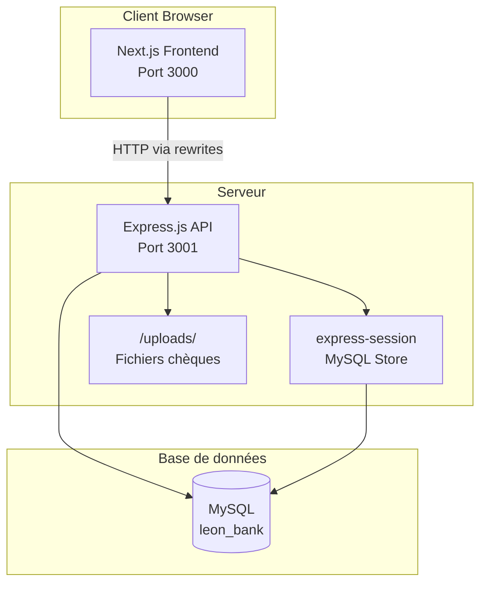
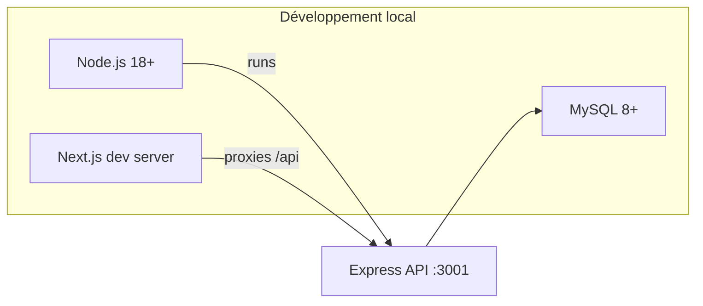
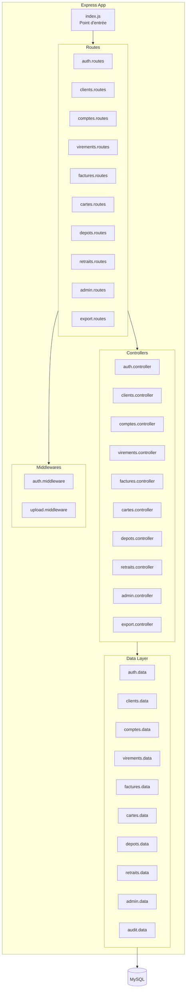
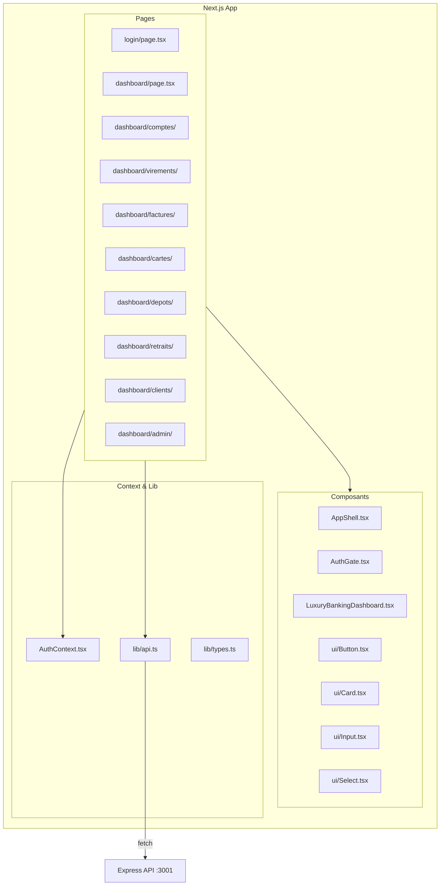
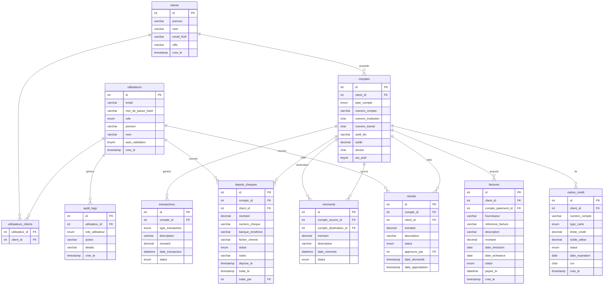
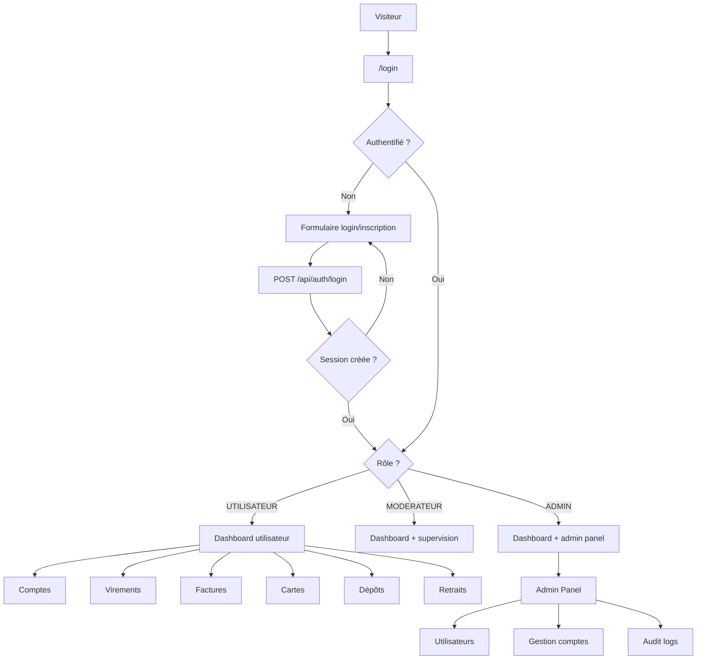

# Conception — Architecture Globale LEON BANK

## Vue d'ensemble

LEON BANK est une application web de gestion bancaire complète. Elle simule un environnement bancaire avec trois niveaux d'accès, une interface client et un back-office de supervision.

---

## Diagramme d'architecture globale

---

## Diagramme de déploiement

---

## Diagramme de composants — Backend

---

## Diagramme de composants — Frontend

---

## Modèle de données — Diagramme ERD complet

---

## Stack technique

| Composant | Technologie | Version |
|-----------|------------|---------|
| Backend | Node.js / Express | 4.19 |
| Authentification | express-session + bcryptjs | 1.19 / 3.0 |
| Base de données | MySQL | 8+ |
| ORM/Query | mysql2 (requêtes directes) | 3.20 |
| Frontend | Next.js | 16.2 |
| UI Framework | React | 19.2 |
| Langage frontend | TypeScript | — |
| Styles | Tailwind CSS | v4 |
| Tests | Jest | 30 |
| Upload fichiers | multer | — |

---

## Flux d'authentification et de navigation

