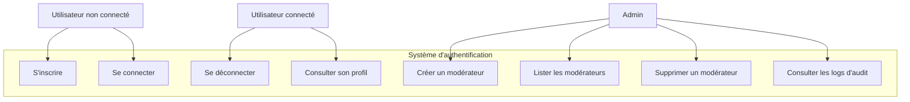
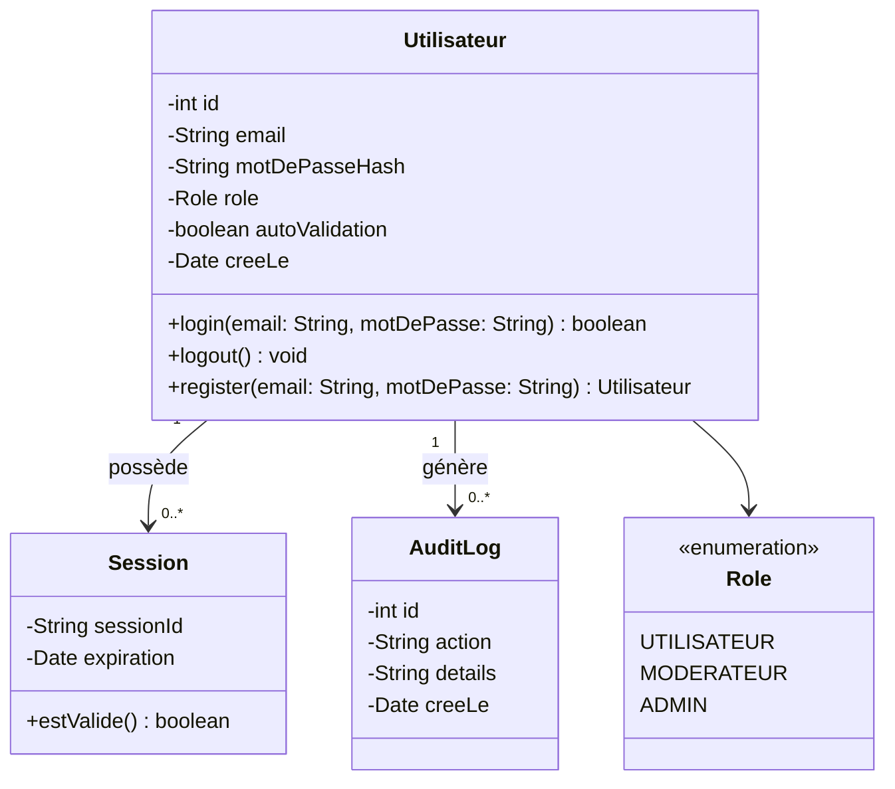
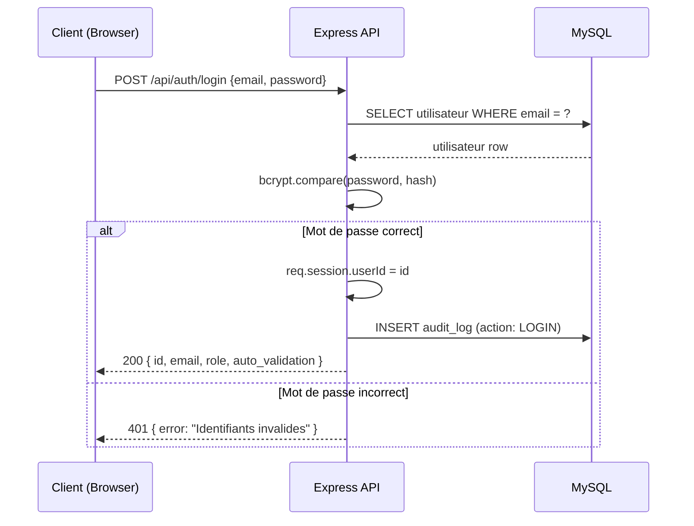
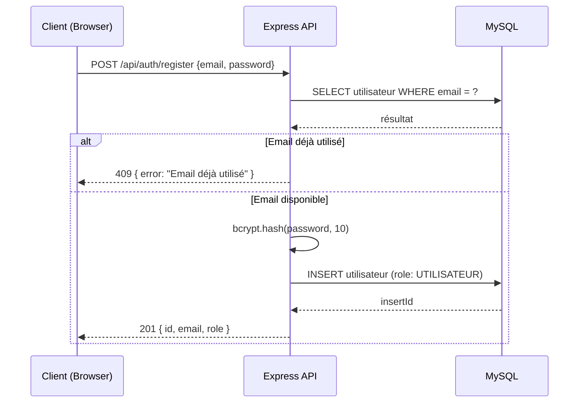
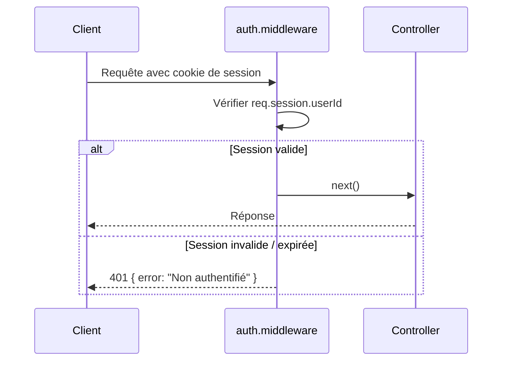
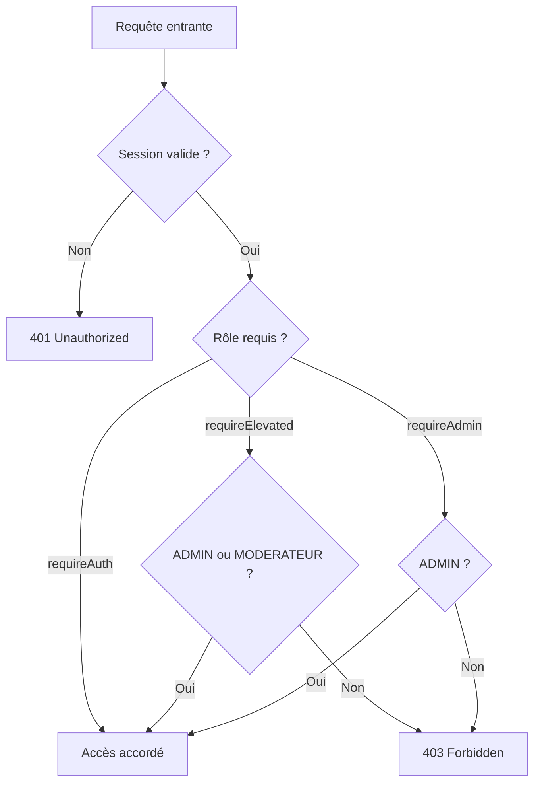

# Conception — Authentification & Sessions

## Description

Le système d'authentification de LEON BANK repose sur des sessions côté serveur gérées par `express-session` avec un store MySQL. Les mots de passe sont hashés avec `bcryptjs`. Trois rôles existent : `UTILISATEUR`, `MODERATEUR`, `ADMIN`. Un flag `auto_validation` permet de bypasser les approbations manuelles sur les dépôts et retraits.

---

## Diagramme de cas d'utilisation

---

## Diagramme de classes

---

## Diagramme de séquence — Connexion

---

## Diagramme de séquence — Inscription

---

## Diagramme de séquence — Vérification de session (middleware)

---

## Flux RBAC (Role-Based Access Control)

---

## Schéma de la table `utilisateurs`

| Colonne | Type | Contraintes |
|---------|------|-------------|
| id | INT | PK, AUTO_INCREMENT |
| email | VARCHAR(190) | UNIQUE, NOT NULL |
| mot_de_passe_hash | VARCHAR(255) | NOT NULL |
| role | ENUM('UTILISATEUR','MODERATEUR','ADMIN') | DEFAULT 'UTILISATEUR' |
| prenom | VARCHAR(80) | NOT NULL |
| nom | VARCHAR(80) | NOT NULL |
| auto_validation | TINYINT(1) | DEFAULT 0 |
| cree_le | TIMESTAMP | DEFAULT CURRENT_TIMESTAMP |

---

## Règles métier

| Règle | Description |
|-------|-------------|
| RB-AUTH-01 | L'inscription crée uniquement le rôle `UTILISATEUR` — impossible de s'auto-assigner ADMIN |
| RB-AUTH-02 | Les sessions expirent après 2 heures (`maxAge: 7200000`) |
| RB-AUTH-03 | Seul un `ADMIN` peut créer ou supprimer un modérateur |
| RB-AUTH-04 | Les actions sensibles (login, logout, gestion modérateurs) sont tracées dans `audit_logs` |
| RB-AUTH-05 | Le flag `auto_validation` permet à un utilisateur de bypasser l'approbation manuelle pour les dépôts et retraits |
| RB-AUTH-06 | Un ADMIN ne peut pas être supprimé via l'API publique |
