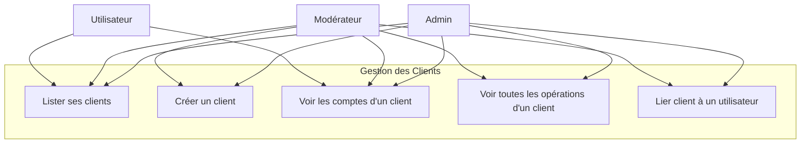
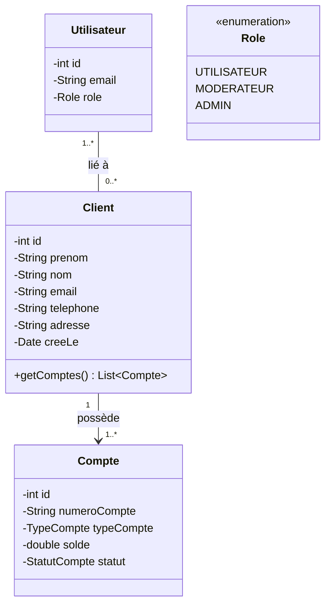
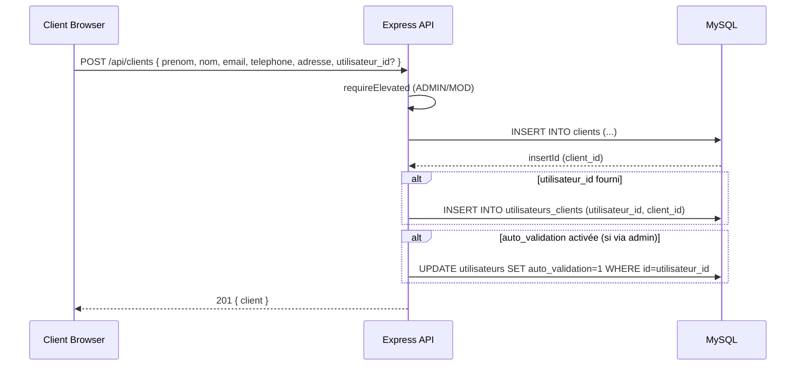
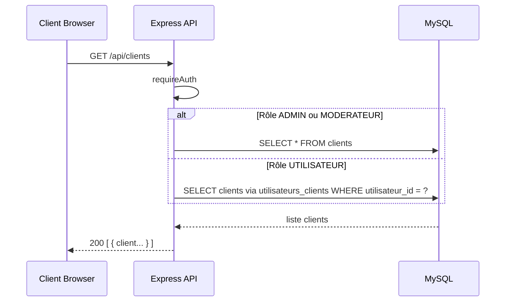
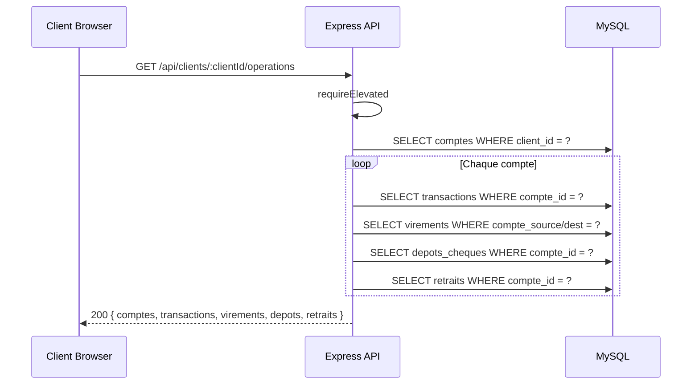

# Conception — Gestion des Clients

## Description

Un **client** représente un profil bancaire fictif (personne physique) distinct du compte utilisateur système. Un utilisateur peut être lié à plusieurs clients via la table de jonction `utilisateurs_clients`. Les admins et modérateurs voient tous les clients; un utilisateur ne voit que les siens.

---

## Diagramme de cas d'utilisation

---

## Diagramme de classes

---

## Diagramme de séquence — Créer un client

---

## Diagramme de séquence — Lister les clients

---

## Diagramme de séquence — Opérations d'un client

---

## Schémas des tables

### Table `clients`

| Colonne | Type | Contraintes |
|---------|------|-------------|
| id | INT | PK, AUTO_INCREMENT |
| prenom | VARCHAR(80) | NOT NULL |
| nom | VARCHAR(80) | NOT NULL |
| email_fictif | VARCHAR(190) | UNIQUE, NOT NULL |
| ville | VARCHAR(120) | nullable |
| cree_le | TIMESTAMP | DEFAULT CURRENT_TIMESTAMP |

### Table `utilisateurs_clients`

| Colonne | Type | Contraintes |
|---------|------|-------------|
| utilisateur_id | INT | FK → utilisateurs.id |
| client_id | INT | FK → clients.id |
| PK | (utilisateur_id, client_id) | UNIQUE |

---

## Règles métier

| Règle | Description |
|-------|-------------|
| RB-CLI-01 | Seuls ADMIN et MODERATEUR peuvent créer un client |
| RB-CLI-02 | Un client peut être lié à aucun ou plusieurs utilisateurs |
| RB-CLI-03 | Un utilisateur peut gérer plusieurs clients (ex: compte famille) |
| RB-CLI-04 | ADMIN et MODERATEUR voient tous les clients du système |
| RB-CLI-05 | Un UTILISATEUR ne voit que ses propres clients (via `utilisateurs_clients`) |
| RB-CLI-06 | La consultation de toutes les opérations d'un client est réservée aux rôles élevés |
