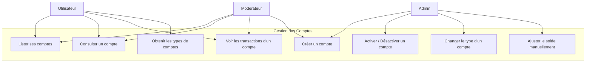
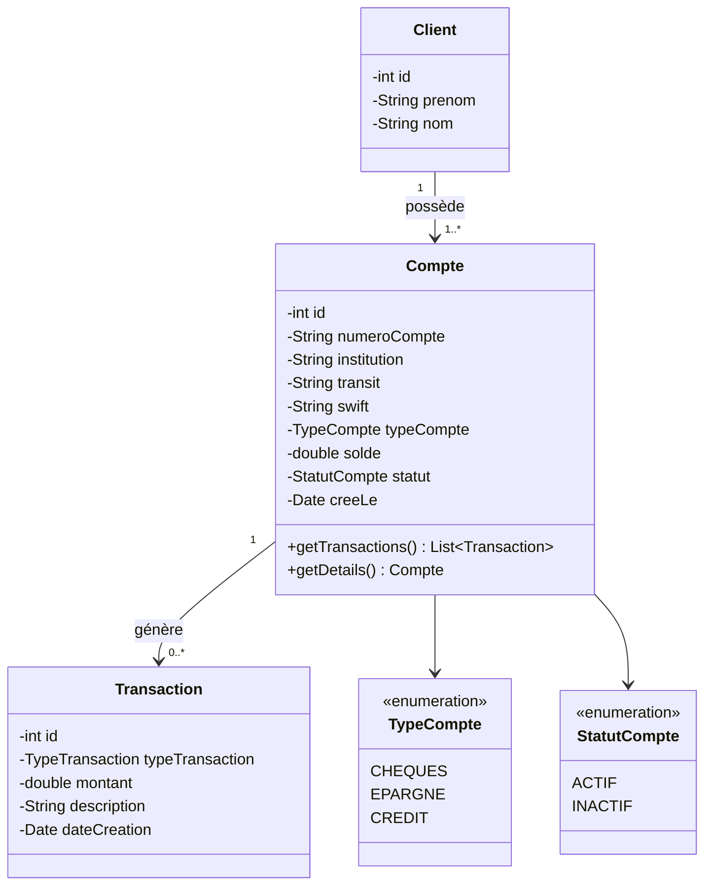
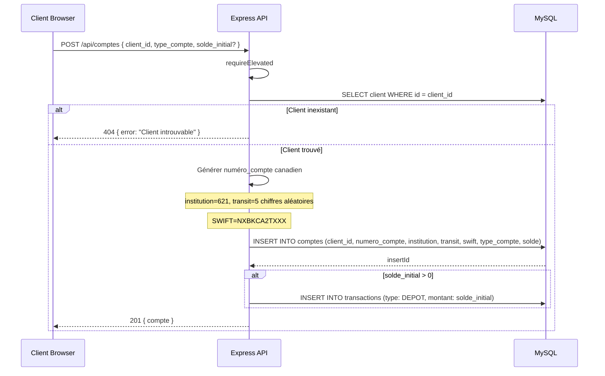
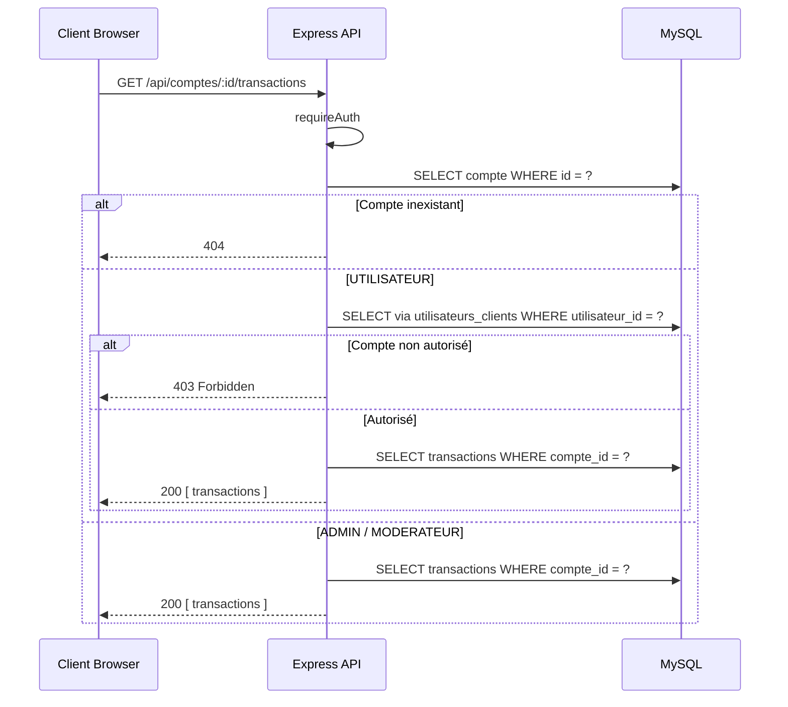

# Conception — Gestion des Comptes

## Description

Les comptes bancaires sont liés à des clients. Trois types existent : `CHEQUES`, `EPARGNE`, `CREDIT`. Chaque compte possède un numéro de compte canadien généré automatiquement (institution 621, transit 5 chiffres, SWIFT NXBKCA2TXXX). Seuls les rôles élevés peuvent créer des comptes.

---

## Diagramme de cas d'utilisation



---

## Diagramme de classes



---

## Diagramme de séquence — Créer un compte



---

## Diagramme de séquence — Consulter les transactions d'un compte



---

## Format du numéro de compte canadien

```
Format: [Institution] [Transit] [Numéro de compte]
Exemple: 621-12345-9876543210

- Institution: 621 (LEON BANK)
- Transit: 5 chiffres aléatoires
- Numéro de compte: 10 chiffres aléatoires
- SWIFT: NXBKCA2TXXX
```

---

## Schéma de la table `comptes`

| Colonne | Type | Contraintes |
|---------|------|-------------|
| id | INT | PK, AUTO_INCREMENT |
| client_id | INT | FK → clients.id |
| type_compte | ENUM('CHEQUES','EPARGNE','CREDIT') | NOT NULL |
| numero_compte | VARCHAR(20) | NOT NULL |
| numero_institution | CHAR(3) | DEFAULT '621' |
| numero_transit | CHAR(5) | DEFAULT '00000' |
| swift_bic | VARCHAR(11) | DEFAULT 'NXBKCA2TXXX' |
| solde | DECIMAL(12,2) | DEFAULT 0.00 |
| devise | CHAR(3) | DEFAULT 'CAD' |
| est_actif | TINYINT(1) | DEFAULT 1 |

## Schéma de la table `transactions`

| Colonne | Type | Contraintes |
|---------|------|-------------|
| id | INT | PK, AUTO_INCREMENT |
| compte_id | INT | FK → comptes.id |
| type_transaction | ENUM('DEPOT','RETRAIT','VIREMENT','PAIEMENT','REMBOURSEMENT') | NOT NULL |
| description | VARCHAR(255) | NOT NULL |
| montant | DECIMAL(12,2) | NOT NULL |
| date_transaction | DATETIME | DEFAULT CURRENT_TIMESTAMP |
| statut | ENUM('TERMINEE','EN_ATTENTE') | DEFAULT 'TERMINEE' |

---

## Règles métier

| Règle | Description |
|-------|-------------|
| RB-CPT-01 | Seuls ADMIN et MODERATEUR peuvent créer des comptes |
| RB-CPT-02 | Le numéro de compte est unique et généré automatiquement |
| RB-CPT-03 | Les types valides sont : `CHEQUES`, `EPARGNE`, `CREDIT` |
| RB-CPT-04 | Un UTILISATEUR ne peut voir que les comptes de ses propres clients |
| RB-CPT-05 | Un compte inactif (`INACTIF`) ne peut pas recevoir de transactions |
| RB-CPT-06 | L'ajustement manuel du solde est réservé à l'ADMIN |
| RB-CPT-07 | Tout dépôt initial à la création génère une transaction de type `DEPOT` |
