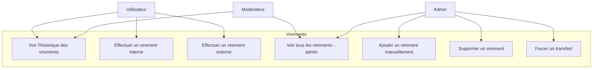
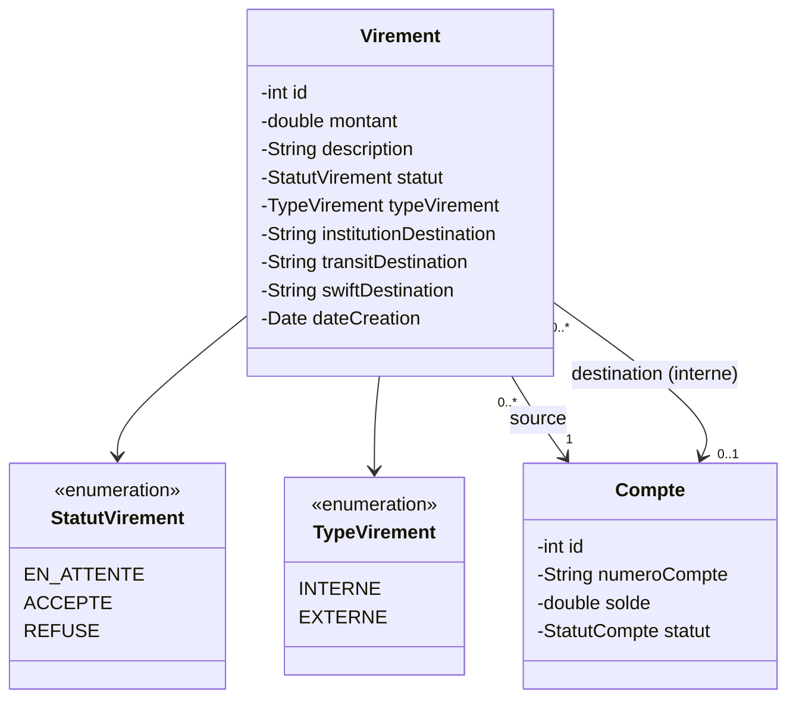
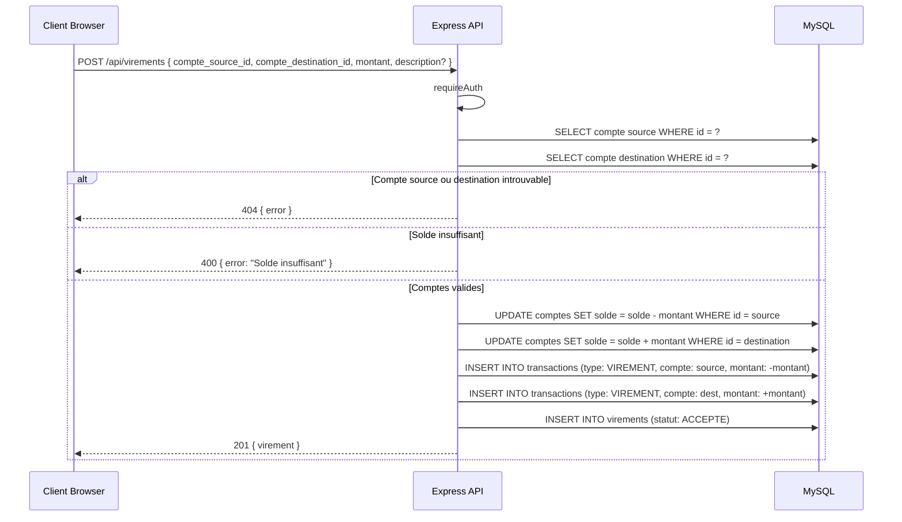
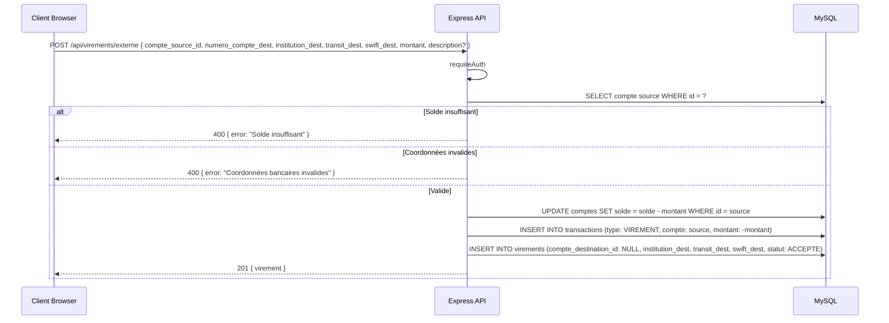
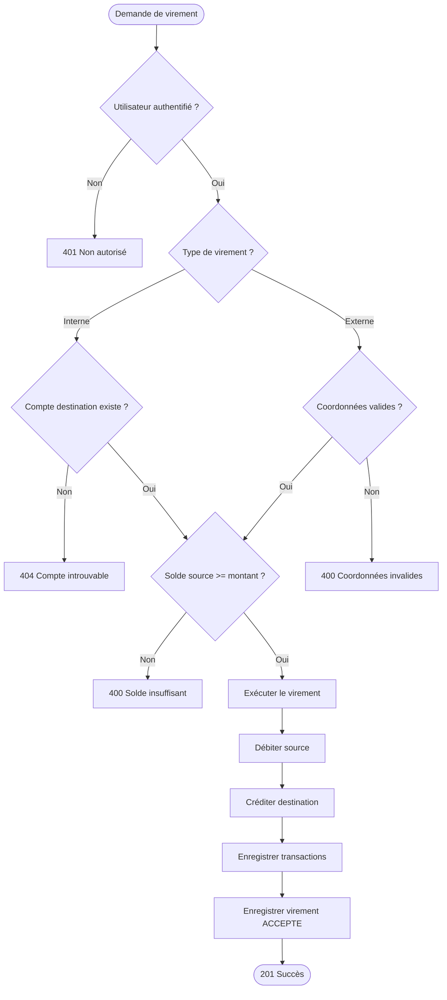

# Conception — Virements

## Description

Deux types de virements sont supportés :
- **Virement interne** : entre deux comptes existants dans le système LEON BANK
- **Virement externe** : vers un compte externe avec coordonnées bancaires (institution, transit, SWIFT)

Les virements peuvent avoir les statuts `EN_ATTENTE`, `ACCEPTE`, `REFUSE`.

---

## Diagramme de cas d'utilisation

---

## Diagramme de classes

---

## Diagramme de séquence — Virement interne

---

## Diagramme de séquence — Virement externe

---

## Flowchart — Validation d'un virement

---

## Schéma de la table `virements`

| Colonne | Type | Contraintes |
|---------|------|-------------|
| id | INT | PK, AUTO_INCREMENT |
| compte_source_id | INT | FK → comptes.id, NOT NULL |
| compte_destination_id | INT | FK → comptes.id, NOT NULL |
| montant | DECIMAL(12,2) | NOT NULL |
| description | VARCHAR(255) | nullable |
| date_virement | DATETIME | DEFAULT CURRENT_TIMESTAMP |
| statut | ENUM('ACCEPTE','REFUSE','EN_ATTENTE') | DEFAULT 'ACCEPTE' |

**Note :** Pour les virements externes, le compte de destination est trouvé via ses coordonnées bancaires (`numero_compte`, `numero_institution`, `numero_transit`, `swift_bic`) — ce compte doit exister dans la base de données LEON BANK. Le système simule uniquement des transferts interbancaires vers des comptes du réseau NEXUS.

---

## Règles métier

| Règle | Description |
|-------|-------------|
| RB-VIR-01 | Un virement interne exige que les deux comptes existent dans le système |
| RB-VIR-02 | Le compte source doit avoir un solde suffisant avant le virement |
| RB-VIR-03 | Un virement externe n'a pas de `compte_destination_id` (NULL) |
| RB-VIR-04 | Les virements sont exécutés immédiatement avec statut `ACCEPTE` |
| RB-VIR-05 | ADMIN et MODERATEUR voient tous les virements ; un UTILISATEUR ne voit que les siens |
| RB-VIR-06 | Un virement génère deux transactions : débit sur source, crédit sur destination |
| RB-VIR-07 | L'ADMIN peut ajouter ou supprimer des virements manuellement via le panel admin |
