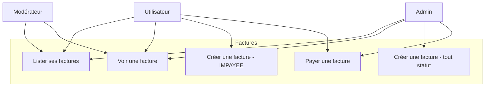
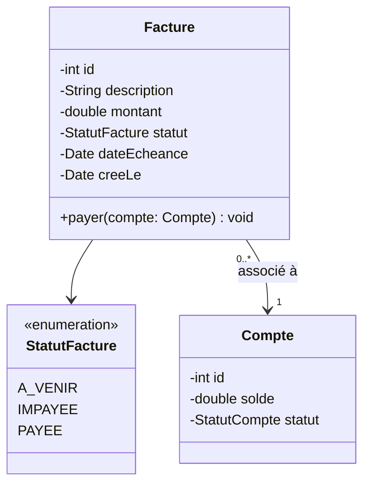
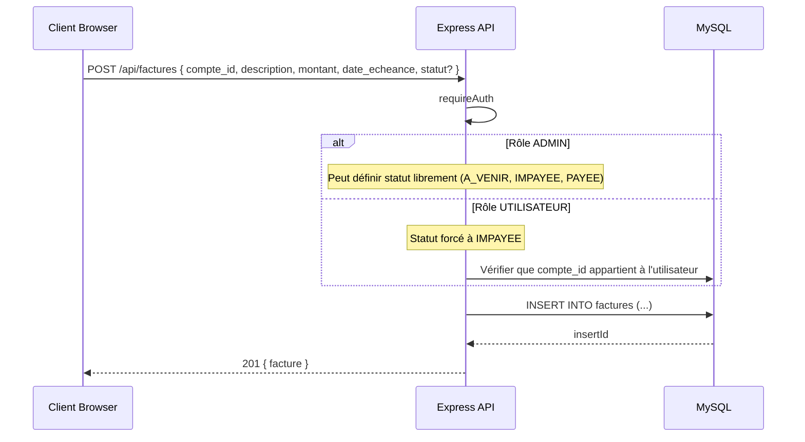
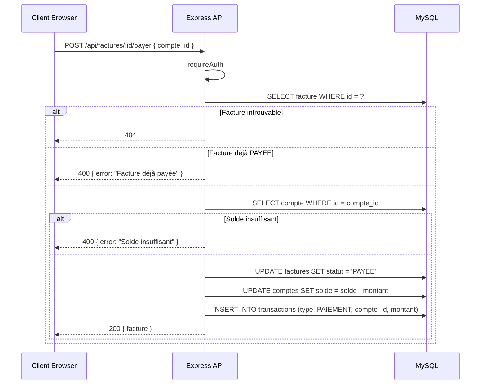
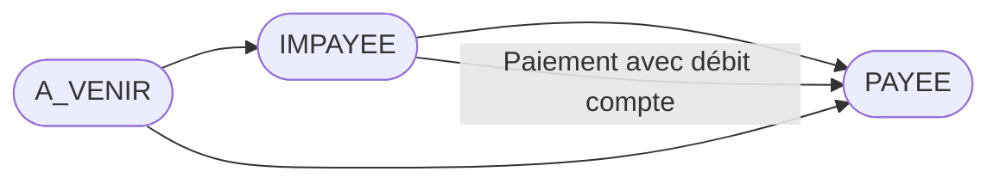

# Conception — Factures

## Description

Le système de factures permet de gérer des obligations de paiement. Les factures ont trois statuts : `A_VENIR` (pas encore due), `IMPAYEE` (due non payée), `PAYEE` (réglée). Les admins peuvent créer des factures avec n'importe quel statut; les utilisateurs créent uniquement des factures `IMPAYEE`. Le paiement débite le compte sélectionné.

---

## Diagramme de cas d'utilisation

---

## Diagramme de classes

---

## Diagramme de séquence — Créer une facture

---

## Diagramme de séquence — Payer une facture

---

## Flowchart — Cycle de vie d'une facture

---

## Schéma de la table `factures`

| Colonne | Type | Contraintes |
|---------|------|-------------|
| id | INT | PK, AUTO_INCREMENT |
| client_id | INT | FK → clients.id, NOT NULL |
| compte_paiement_id | INT | FK → comptes.id, nullable |
| fournisseur | VARCHAR(120) | NOT NULL |
| reference_facture | VARCHAR(60) | NOT NULL |
| description | VARCHAR(255) | nullable |
| montant | DECIMAL(12,2) | NOT NULL |
| date_emission | DATE | NOT NULL |
| date_echeance | DATE | NOT NULL |
| statut | ENUM('A_VENIR','IMPAYEE','PAYEE') | DEFAULT 'A_VENIR' |
| payee_le | DATETIME | nullable |
| cree_le | TIMESTAMP | DEFAULT CURRENT_TIMESTAMP |

---

## Règles métier

| Règle | Description |
|-------|-------------|
| RB-FAC-01 | Un UTILISATEUR crée des factures avec statut `IMPAYEE` uniquement |
| RB-FAC-02 | Un ADMIN peut créer des factures avec n'importe quel statut |
| RB-FAC-03 | Une facture `PAYEE` ne peut pas être payée à nouveau |
| RB-FAC-04 | Le paiement débite le compte et génère une transaction de type `PAIEMENT` |
| RB-FAC-05 | Le compte doit avoir un solde suffisant pour payer une facture |
| RB-FAC-06 | ADMIN et MODERATEUR voient toutes les factures ; un UTILISATEUR ne voit que les siennes |
