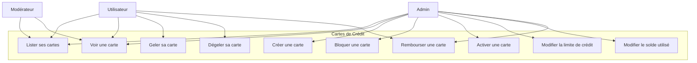
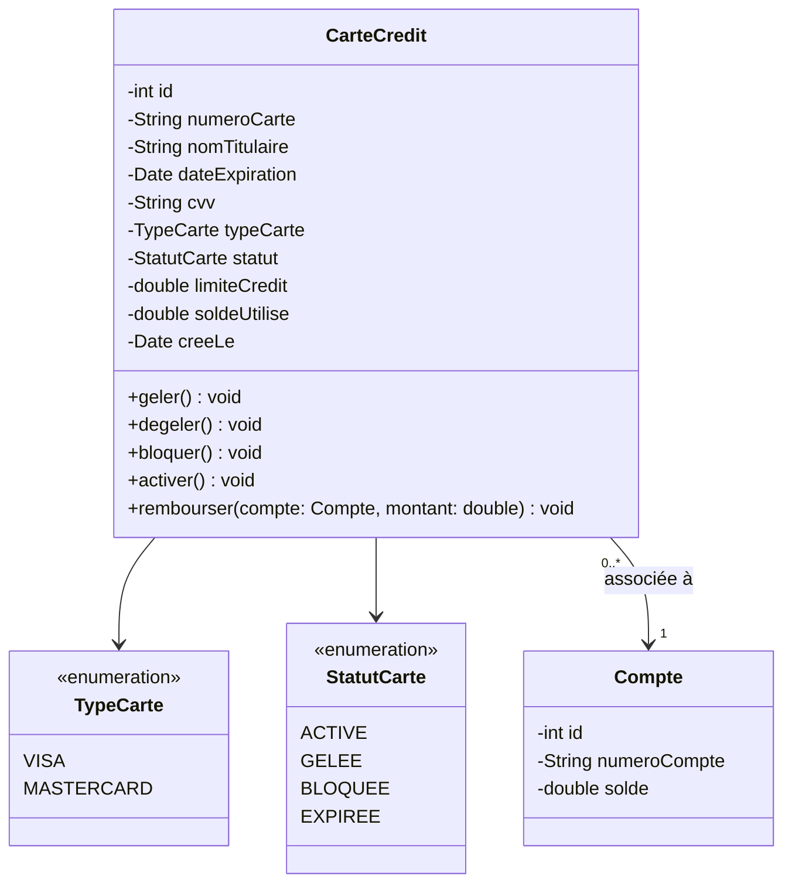
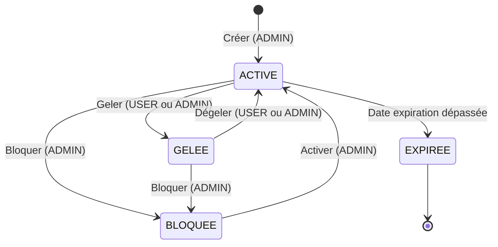
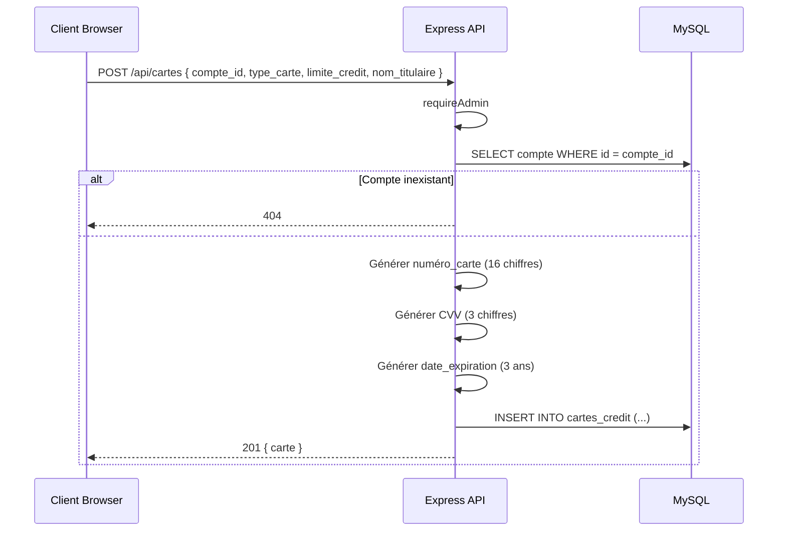
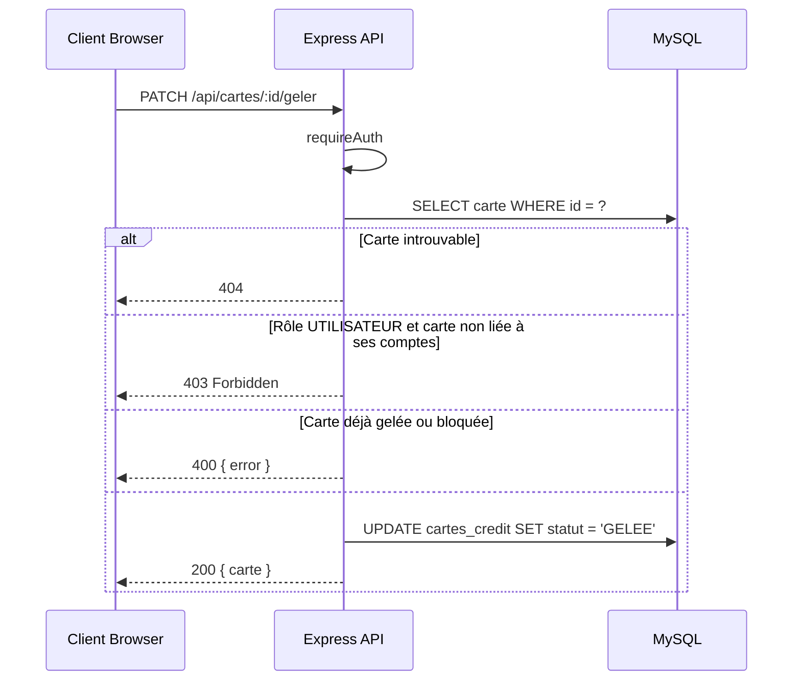
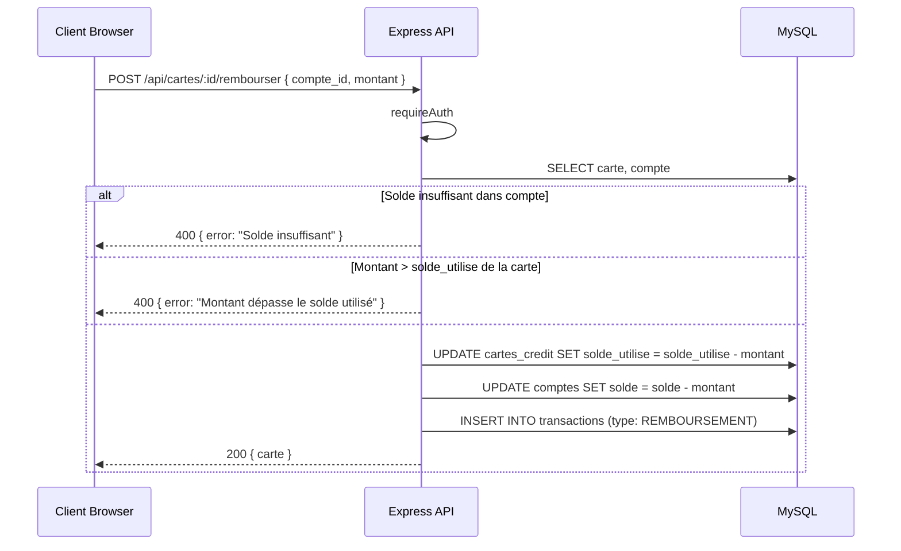

# Conception — Cartes de Crédit

## Description

Les cartes de crédit sont liées à un compte bancaire. Deux types : `VISA` et `MASTERCARD`. Quatre statuts possibles : `ACTIVE`, `GELEE`, `BLOQUEE`, `EXPIREE`. L'ADMIN gère le cycle de vie complet (créer, bloquer, activer, modifier les limites). L'utilisateur peut seulement geler/dégeler sa propre carte.

---

## Diagramme de cas d'utilisation

---

## Diagramme de classes

---

## Diagramme d'états — Carte de crédit

---

## Diagramme de séquence — Créer une carte

---

## Diagramme de séquence — Geler une carte (utilisateur)

---

## Diagramme de séquence — Rembourser une carte

---

## Schéma de la table `cartes_credit`

| Colonne | Type | Contraintes |
|---------|------|-------------|
| id | INT | PK, AUTO_INCREMENT |
| client_id | INT | FK → clients.id |
| numero_compte | VARCHAR(22) | NOT NULL (numéro de carte 16 chiffres format `XXXX XXXX XXXX XXXX`) |
| type_carte | ENUM('VISA','MASTERCARD') | DEFAULT 'VISA' |
| limite_credit | DECIMAL(12,2) | DEFAULT 5000.00 |
| solde_utilise | DECIMAL(12,2) | DEFAULT 0.00 |
| statut | ENUM('ACTIVE','GELEE','BLOQUEE','EXPIREE') | DEFAULT 'ACTIVE' |
| date_expiration | DATE | NOT NULL |
| cvv | CHAR(3) | NOT NULL |
| cree_le | TIMESTAMP | DEFAULT CURRENT_TIMESTAMP |

**Note :** La carte est liée à un `client_id` (pas à un `compte_id`). Le remboursement utilise un compte CHEQUES/EPARGNE appartenant au même client.

---

## Règles métier

| Règle | Description |
|-------|-------------|
| RB-CARTE-01 | Seul l'ADMIN peut créer une carte de crédit |
| RB-CARTE-02 | Seul l'ADMIN peut bloquer/activer une carte |
| RB-CARTE-03 | Un UTILISATEUR peut geler/dégeler uniquement sa propre carte |
| RB-CARTE-04 | Une carte `BLOQUEE` ne peut pas être gelée (seulement activée) |
| RB-CARTE-05 | Le numéro de carte (16 chiffres), CVV (3 chiffres) et date d'expiration sont générés automatiquement |
| RB-CARTE-06 | L'expiration est fixée à 3 ans après la création |
| RB-CARTE-07 | Le remboursement débite le compte associé et réduit le `solde_utilise` |
| RB-CARTE-08 | On ne peut pas rembourser plus que le `solde_utilise` |
| RB-CARTE-09 | L'ADMIN peut modifier directement `limite_credit` et `solde_utilise` |
