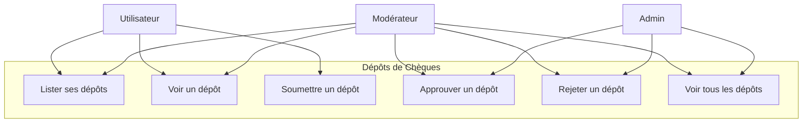
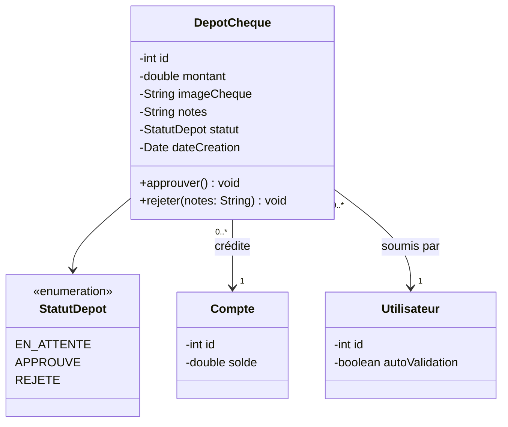
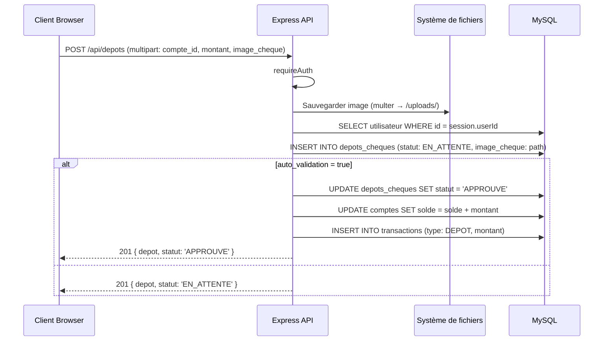
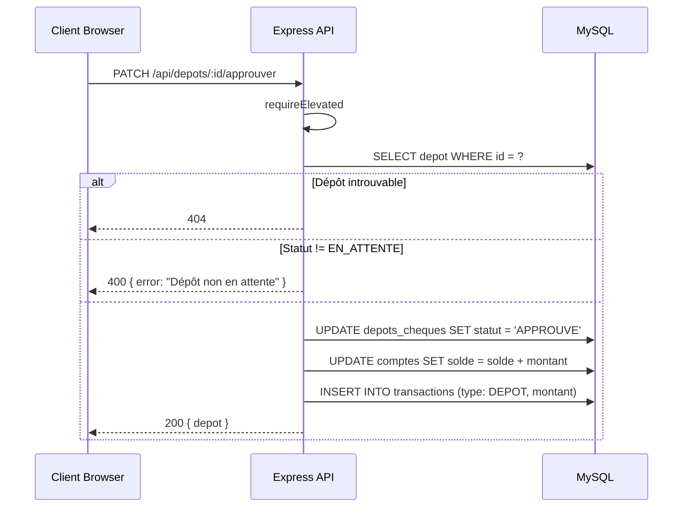
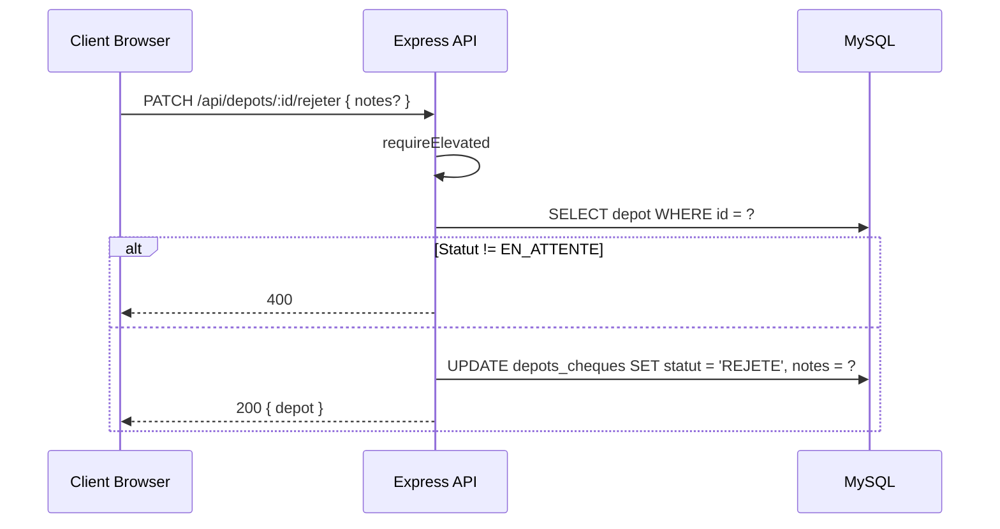
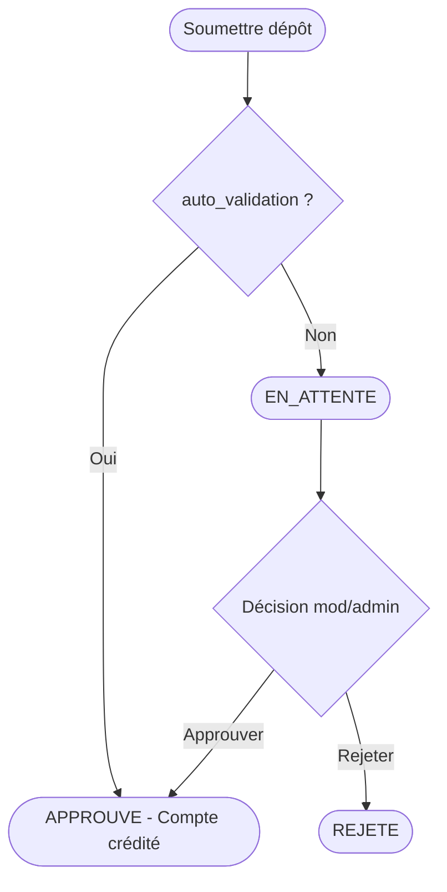

# Conception — Dépôts de Chèques

## Description

Les utilisateurs peuvent soumettre des dépôts de chèques avec une image (photo du chèque). Les dépôts passent par un processus d'approbation sauf si le flag `auto_validation` est activé sur l'utilisateur. Les statuts sont `EN_ATTENTE`, `APPROUVE`, `REJETE`.

---

## Diagramme de cas d'utilisation

---

## Diagramme de classes

---

## Diagramme de séquence — Soumettre un dépôt

---

## Diagramme de séquence — Approuver un dépôt

---

## Diagramme de séquence — Rejeter un dépôt

---

## Flowchart — Cycle de vie d'un dépôt

---

## Schéma de la table `depots_cheques`

| Colonne | Type | Contraintes |
|---------|------|-------------|
| id | INT | PK, AUTO_INCREMENT |
| compte_id | INT | FK → comptes.id |
| client_id | INT | FK → clients.id |
| montant | DECIMAL(12,2) | NOT NULL |
| numero_cheque | VARCHAR(50) | NOT NULL |
| banque_emettrice | VARCHAR(120) | NOT NULL |
| fichier_chemin | VARCHAR(500) | nullable (chemin fichier dans uploads/depots/) |
| statut | ENUM('EN_ATTENTE','APPROUVE','REJETE') | DEFAULT 'EN_ATTENTE' |
| notes | VARCHAR(255) | nullable |
| depose_le | TIMESTAMP | DEFAULT CURRENT_TIMESTAMP |
| traite_le | TIMESTAMP | nullable |
| traite_par | INT | FK → utilisateurs.id, nullable |

---

## Règles métier

| Règle | Description |
|-------|-------------|
| RB-DEP-01 | L'image du chèque est obligatoire lors de la soumission |
| RB-DEP-02 | Si `auto_validation = true` sur l'utilisateur, le dépôt est immédiatement approuvé |
| RB-DEP-03 | Seuls ADMIN et MODERATEUR peuvent approuver ou rejeter |
| RB-DEP-04 | L'approbation crédite le compte et génère une transaction de type `DEPOT` |
| RB-DEP-05 | Un dépôt ne peut être approuvé/rejeté que s'il est en statut `EN_ATTENTE` |
| RB-DEP-06 | Les fichiers uploadés sont stockés dans le dossier `/uploads/` |
| RB-DEP-07 | ADMIN et MODERATEUR voient tous les dépôts ; un UTILISATEUR ne voit que les siens |
