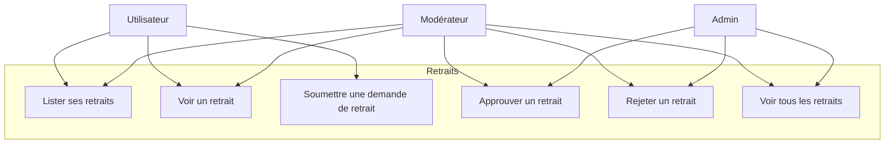
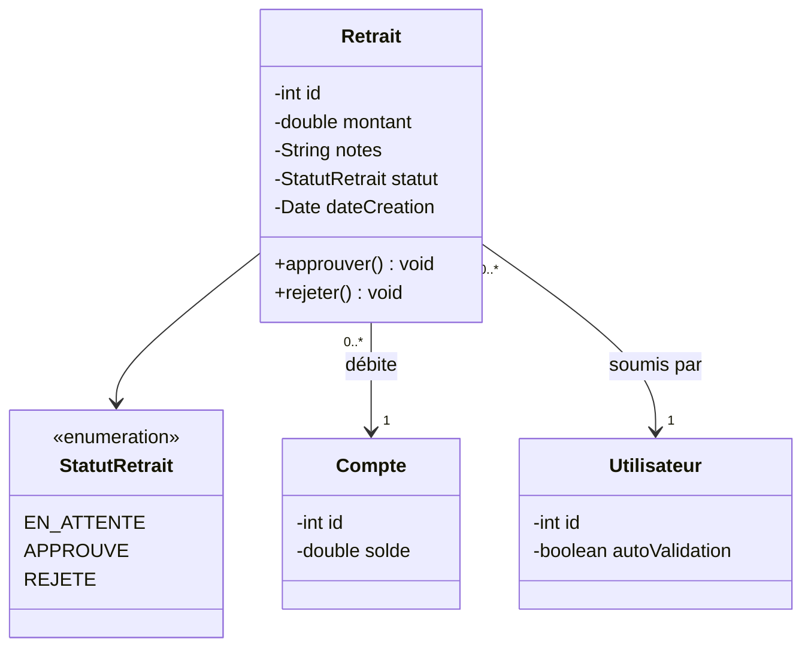
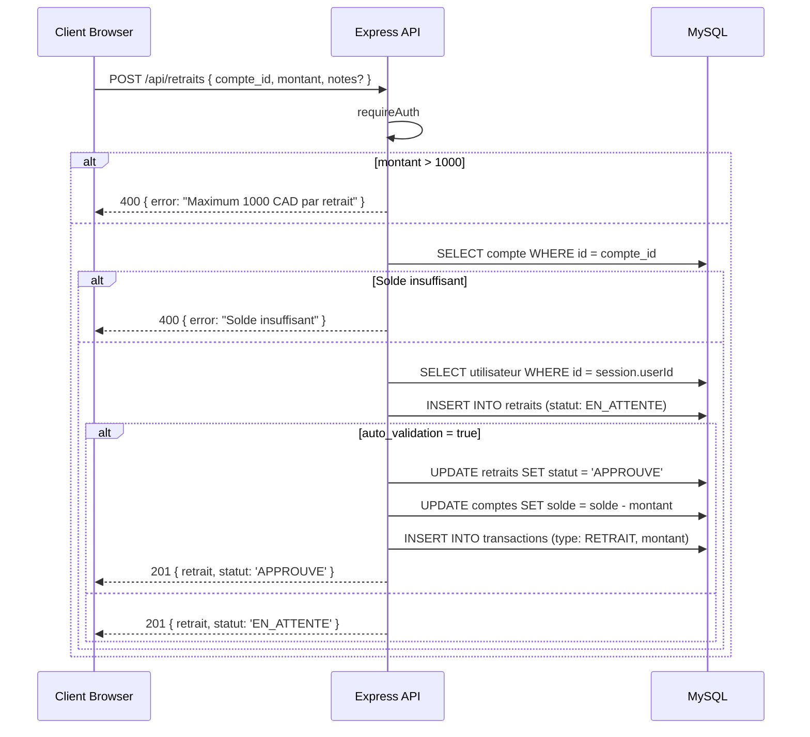
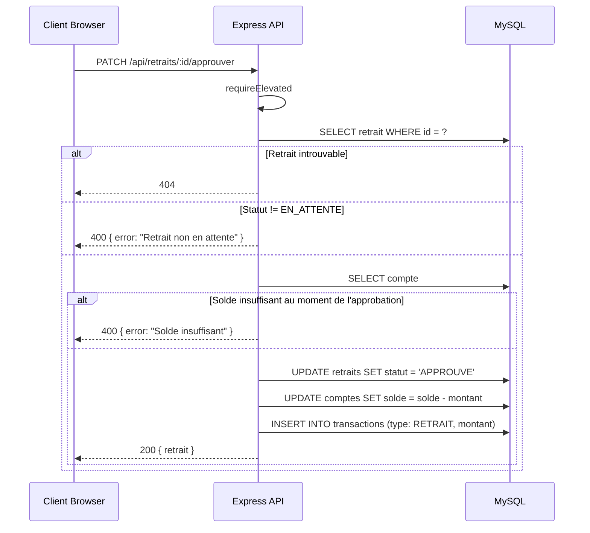
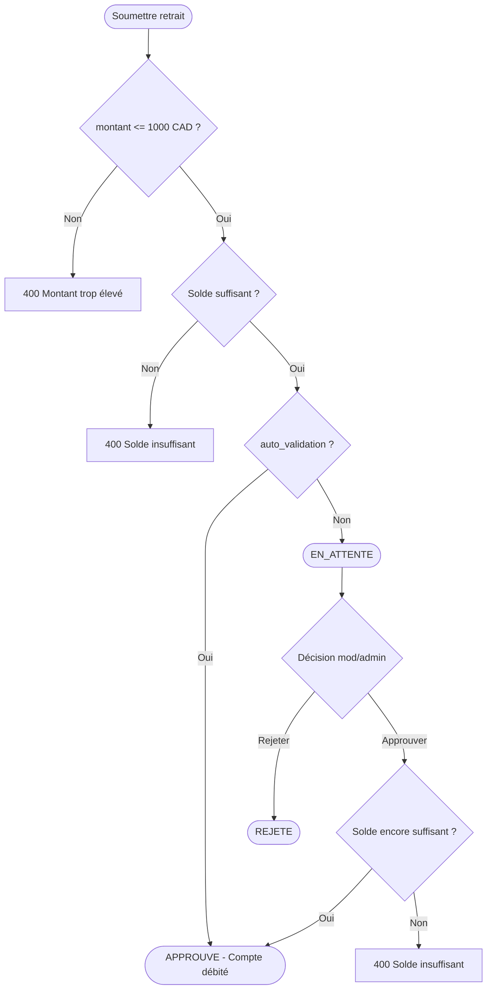

# Conception — Retraits

## Description

Les utilisateurs peuvent soumettre des demandes de retrait d'argent liquide. Le montant maximum par retrait est de **1000 CAD**. Les demandes passent par approbation sauf si `auto_validation` est activé. Les statuts sont `EN_ATTENTE`, `APPROUVE`, `REJETE`.

---

## Diagramme de cas d'utilisation

---

## Diagramme de classes

---

## Diagramme de séquence — Soumettre un retrait

---

## Diagramme de séquence — Approuver un retrait

---

## Flowchart — Cycle de vie d'un retrait

---

## Comparaison avec les Dépôts de Chèques

| Aspect | Dépôt de Chèque | Retrait |
|--------|----------------|---------|
| Direction | Crédit compte | Débit compte |
| Montant max | Aucune limite | 1000 CAD |
| Fichier requis | Oui (image chèque) | Non |
| auto_validation | Oui | Oui |
| Approbation | ADMIN / MOD | ADMIN / MOD |

---

## Schéma de la table `retraits`

| Colonne | Type | Contraintes |
|---------|------|-------------|
| id | INT | PK, AUTO_INCREMENT |
| compte_id | INT | FK → comptes.id |
| client_id | INT | FK → clients.id |
| montant | DECIMAL(12,2) | NOT NULL |
| description | VARCHAR(255) | nullable |
| statut | ENUM('EN_ATTENTE','APPROUVE','REJETE') | DEFAULT 'EN_ATTENTE' |
| approuve_par | INT | FK → utilisateurs.id, nullable |
| date_demande | TIMESTAMP | DEFAULT CURRENT_TIMESTAMP |
| date_approbation | TIMESTAMP | nullable |

---

## Règles métier

| Règle | Description |
|-------|-------------|
| RB-RET-01 | Le montant maximum par retrait est de 1000 CAD |
| RB-RET-02 | Le compte doit avoir un solde suffisant avant la soumission |
| RB-RET-03 | Si `auto_validation = true`, le retrait est immédiatement approuvé |
| RB-RET-04 | Seuls ADMIN et MODERATEUR peuvent approuver ou rejeter |
| RB-RET-05 | L'approbation débite le compte et génère une transaction de type `RETRAIT` |
| RB-RET-06 | Un retrait ne peut être approuvé/rejeté que s'il est en statut `EN_ATTENTE` |
| RB-RET-07 | Le solde est re-vérifié au moment de l'approbation |
| RB-RET-08 | ADMIN et MODERATEUR voient tous les retraits ; un UTILISATEUR ne voit que les siens |
