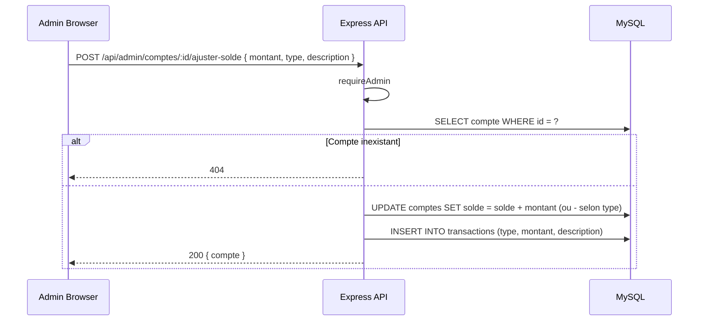
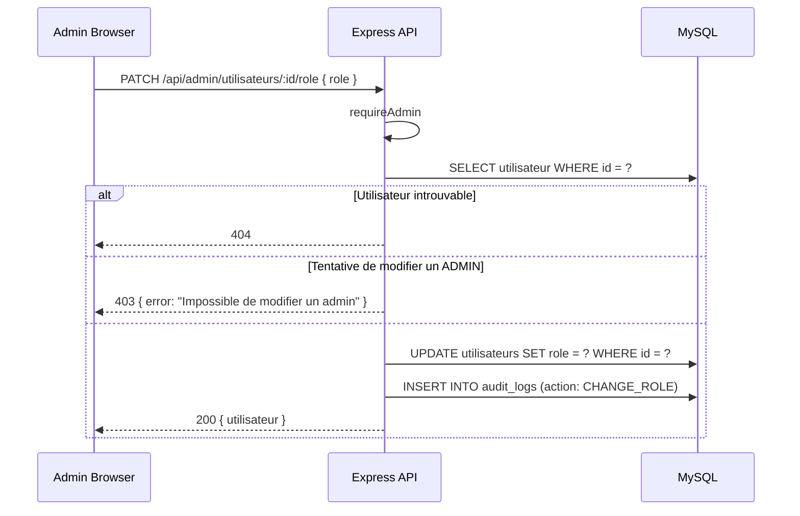
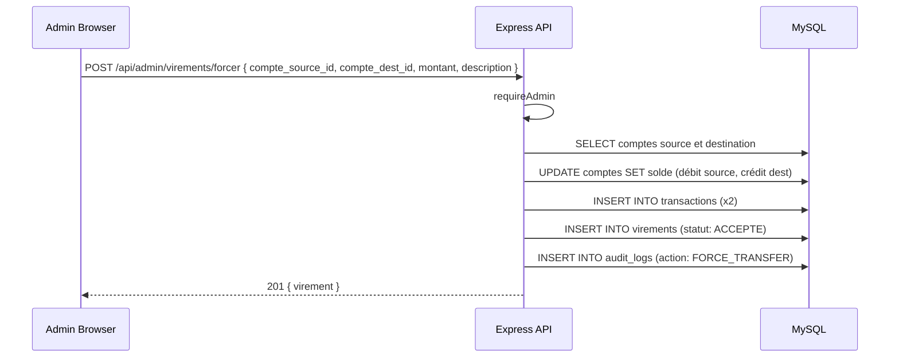
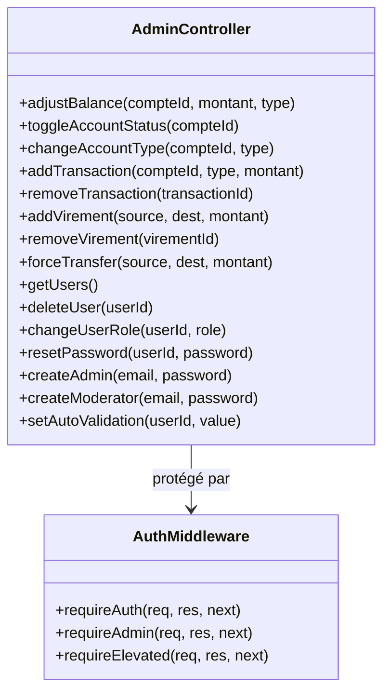

# Conception — Administration & Modération

## Description

Le système propose deux niveaux de rôles élevés :
- **MODERATEUR** : supervision, validation des dépôts/retraits, création de clients/comptes
- **ADMIN** : toutes les fonctions de modérateur + gestion des comptes, transactions, virements, utilisateurs, audit

---

## Diagramme de cas d'utilisation

```mermaid
graph TD
    subgraph Panel Admin - Comptes
        A1[Ajuster solde d'un compte]
        A2[Activer / Désactiver un compte]
        A3[Changer type de compte]
    end

    subgraph Panel Admin - Transactions
        A4[Ajouter transaction manuelle]
        A5[Supprimer transaction]
    end

    subgraph Panel Admin - Virements
        A6[Ajouter virement manuel]
        A7[Supprimer virement]
        A8[Forcer un transfert]
    end

    subgraph Panel Admin - Utilisateurs
        A9[Lister tous les utilisateurs]
        A10[Supprimer un utilisateur]
        A11[Changer rôle d'un utilisateur]
        A12[Réinitialiser mot de passe]
        A13[Créer admin]
        A14[Créer modérateur]
        A15[Gérer auto_validation]
    end

    subgraph Modérateur
        M1[Voir tous les clients]
        M2[Voir tous les comptes]
        M3[Approuver dépôts et retraits]
        M4[Créer clients et comptes]
    end

    ADM[Admin] --> A1
    ADM --> A2
    ADM --> A3
    ADM --> A4
    ADM --> A5
    ADM --> A6
    ADM --> A7
    ADM --> A8
    ADM --> A9
    ADM --> A10
    ADM --> A11
    ADM --> A12
    ADM --> A13
    ADM --> A14
    ADM --> A15
    ADM --> M1
    ADM --> M2
    ADM --> M3
    ADM --> M4

    MOD[Modérateur] --> M1
    MOD --> M2
    MOD --> M3
    MOD --> M4
```

---

## Matrice des permissions RBAC

| Fonctionnalité | UTILISATEUR | MODERATEUR | ADMIN |
|----------------|:-----------:|:----------:|:-----:|
| Voir ses clients | ✓ | ✓ | ✓ |
| Voir tous les clients | ✗ | ✓ | ✓ |
| Créer un client | ✗ | ✓ | ✓ |
| Voir ses comptes | ✓ | ✓ | ✓ |
| Voir tous les comptes | ✗ | ✓ | ✓ |
| Créer un compte | ✗ | ✓ | ✓ |
| Ajuster solde compte | ✗ | ✗ | ✓ |
| Activer/désactiver compte | ✗ | ✗ | ✓ |
| Voir ses virements | ✓ | ✓ | ✓ |
| Voir tous les virements | ✗ | ✓ | ✓ |
| Créer virement | ✓ | ✓ | ✓ |
| Virement forcé (admin) | ✗ | ✗ | ✓ |
| Créer facture IMPAYEE | ✓ | ✗ | ✓ |
| Créer facture tout statut | ✗ | ✗ | ✓ |
| Payer facture | ✓ | ✗ | ✓ |
| Geler carte (propre) | ✓ | ✗ | ✓ |
| Créer/bloquer/activer carte | ✗ | ✗ | ✓ |
| Soumettre dépôt/retrait | ✓ | ✓ | ✓ |
| Approuver dépôt/retrait | ✗ | ✓ | ✓ |
| Gérer utilisateurs | ✗ | ✗ | ✓ |
| Consulter audit logs | ✗ | ✗ | ✓ |
| Export CSV | partiel | ✓ | ✓ |

---

## Diagramme de séquence — Ajuster le solde d'un compte

---

## Diagramme de séquence — Changer le rôle d'un utilisateur

---

## Diagramme de séquence — Forcer un transfert

---

## Diagramme de classes — Administration

---

## Routes Admin complètes

### Gestion des comptes
| Méthode | Route | Permission | Action |
|---------|-------|-----------|--------|
| POST | `/api/admin/comptes/:id/ajuster-solde` | ADMIN | Ajuster solde |
| PATCH | `/api/admin/comptes/:id/statut` | ADMIN | Toggle actif/inactif |
| PATCH | `/api/admin/comptes/:id/type` | ADMIN | Changer type |

### Gestion des transactions
| Méthode | Route | Permission | Action |
|---------|-------|-----------|--------|
| POST | `/api/admin/transactions` | ADMIN | Ajouter transaction |
| DELETE | `/api/admin/transactions/:id` | ADMIN | Supprimer transaction |

### Gestion des virements
| Méthode | Route | Permission | Action |
|---------|-------|-----------|--------|
| POST | `/api/admin/virements` | ADMIN | Ajouter virement |
| DELETE | `/api/admin/virements/:id` | ADMIN | Supprimer virement |
| POST | `/api/admin/virements/forcer` | ADMIN | Forcer transfert |

### Gestion des utilisateurs
| Méthode | Route | Permission | Action |
|---------|-------|-----------|--------|
| GET | `/api/admin/utilisateurs` | ELEVATED | Lister utilisateurs |
| DELETE | `/api/admin/utilisateurs/:id` | ADMIN | Supprimer utilisateur |
| PATCH | `/api/admin/utilisateurs/:id/role` | ADMIN | Changer rôle |
| PATCH | `/api/admin/utilisateurs/:id/password` | ADMIN | Reset password |
| POST | `/api/admin/utilisateurs/admin` | ADMIN | Créer admin |
| POST | `/api/admin/utilisateurs/moderateur` | ADMIN | Créer modérateur |
| PATCH | `/api/admin/utilisateurs/:id/auto-validation` | ADMIN | Toggle auto_validation |

---

## Règles métier

| Règle | Description |
|-------|-------------|
| RB-ADM-01 | Seul l'ADMIN a accès au panel de gestion avancé |
| RB-ADM-02 | Un ADMIN ne peut pas être supprimé via l'API |
| RB-ADM-03 | Le changement de rôle ne peut pas targeter un ADMIN |
| RB-ADM-04 | Toutes les actions sensibles admin sont tracées dans `audit_logs` |
| RB-ADM-05 | `auto_validation` permet de bypasser le processus d'approbation |
| RB-ADM-06 | Le mot de passe d'un utilisateur peut être réinitialisé par l'ADMIN |
| RB-ADM-07 | L'ADMIN peut forcer des transferts sans validation de solde minimum |
