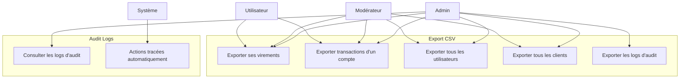
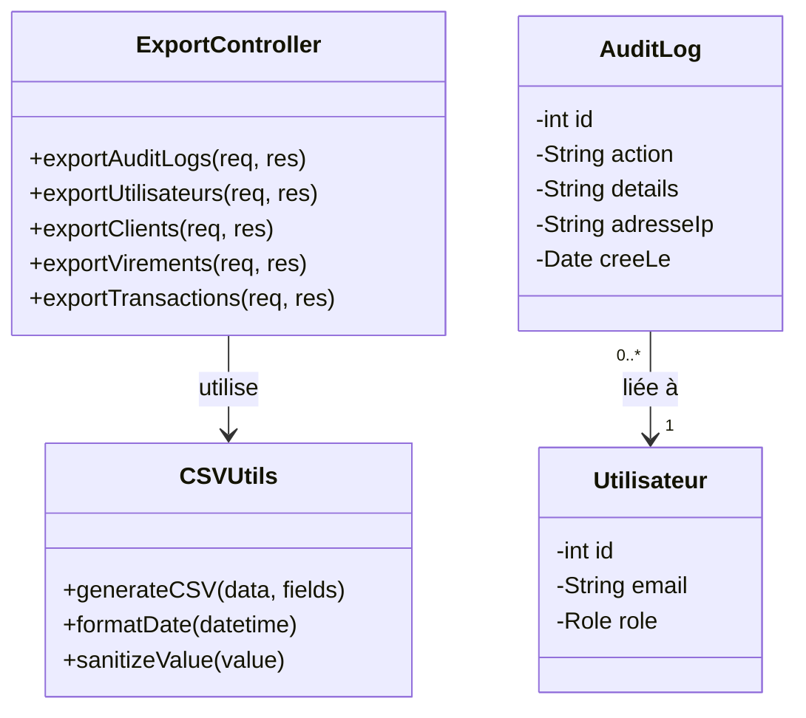
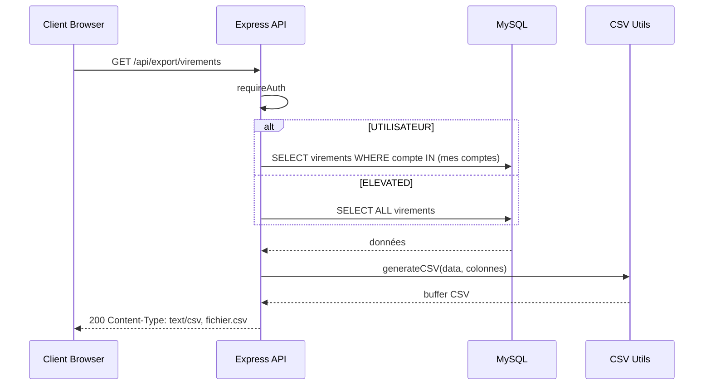
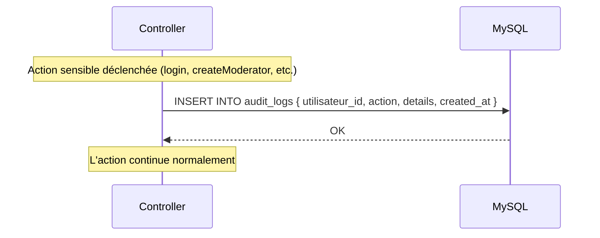

# Conception — Export CSV & Audit Logs

## Description

Le système propose deux fonctionnalités transversales :
- **Export CSV** : génération de fichiers CSV pour différentes entités (utilisateurs, clients, virements, transactions, audit)
- **Audit Logs** : traçabilité des actions sensibles avec horodatage

---

## Diagramme de cas d'utilisation



---

## Diagramme de classes



---

## Diagramme de séquence — Export CSV



---

## Diagramme de séquence — Enregistrement d'un audit log



---

## Actions auditées

| Action | Déclencheur |
|--------|-------------|
| `LOGIN` | Connexion réussie |
| `LOGOUT` | Déconnexion |
| `CREATE_MODERATEUR` | Création d'un modérateur par admin |
| `DELETE_MODERATEUR` | Suppression d'un modérateur |
| `GET_AUDIT_LOGS` | Consultation des logs d'audit |
| `FORCE_TRANSFER` | Transfert forcé par admin |
| `CHANGE_ROLE` | Changement de rôle utilisateur |
| `RESET_PASSWORD` | Réinitialisation de mot de passe |
| `DELETE_USER` | Suppression d'utilisateur |
| `CREATE_ADMIN` | Création d'un admin |

---

## Endpoints d'export

| Route | Permission | Contenu exporté |
|-------|-----------|-----------------|
| `GET /api/export/audit` | ADMIN | Logs d'audit complets |
| `GET /api/export/utilisateurs` | ELEVATED | Tous les utilisateurs |
| `GET /api/export/clients` | ELEVATED | Tous les clients |
| `GET /api/export/virements` | AUTH | Virements (filtrés par rôle) |
| `GET /api/export/transactions/:compteId` | AUTH | Transactions d'un compte |

---

## Format des fichiers CSV exportés

### Export Virements
```
id, compte_source, compte_destination, montant, statut, type, description, date
```

### Export Transactions
```
id, compte_id, type_transaction, montant, description, date
```

### Export Utilisateurs
```
id, email, role, auto_validation, date_creation
```

### Export Clients
```
id, prenom, nom, email, telephone, adresse, date_creation
```

### Export Audit
```
id, utilisateur_email, action, details, date
```

---

## Schéma de la table `audit_logs`

| Colonne | Type | Contraintes |
|---------|------|-------------|
| id | INT | PK, AUTO_INCREMENT |
| utilisateur_id | INT | FK → utilisateurs.id, NOT NULL |
| role_utilisateur | ENUM('UTILISATEUR','MODERATEUR','ADMIN') | NOT NULL |
| action | VARCHAR(80) | NOT NULL |
| details | VARCHAR(255) | nullable |
| cree_le | TIMESTAMP | DEFAULT CURRENT_TIMESTAMP |

---

## Règles métier

| Règle | Description |
|-------|-------------|
| RB-EXP-01 | L'export d'audit est réservé à l'ADMIN |
| RB-EXP-02 | L'export utilisateurs et clients requiert un rôle élevé (ADMIN/MOD) |
| RB-EXP-03 | Un UTILISATEUR ne peut exporter que ses propres virements et transactions |
| RB-EXP-04 | Les fichiers CSV sont générés à la volée (pas de stockage) |
| RB-EXP-05 | Les audit logs sont créés automatiquement par le système sans action utilisateur |
| RB-EXP-06 | Les audit logs sont en lecture seule — aucune modification/suppression possible |
