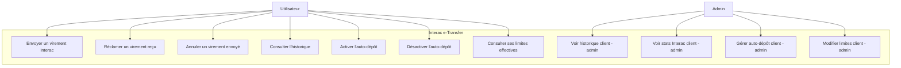
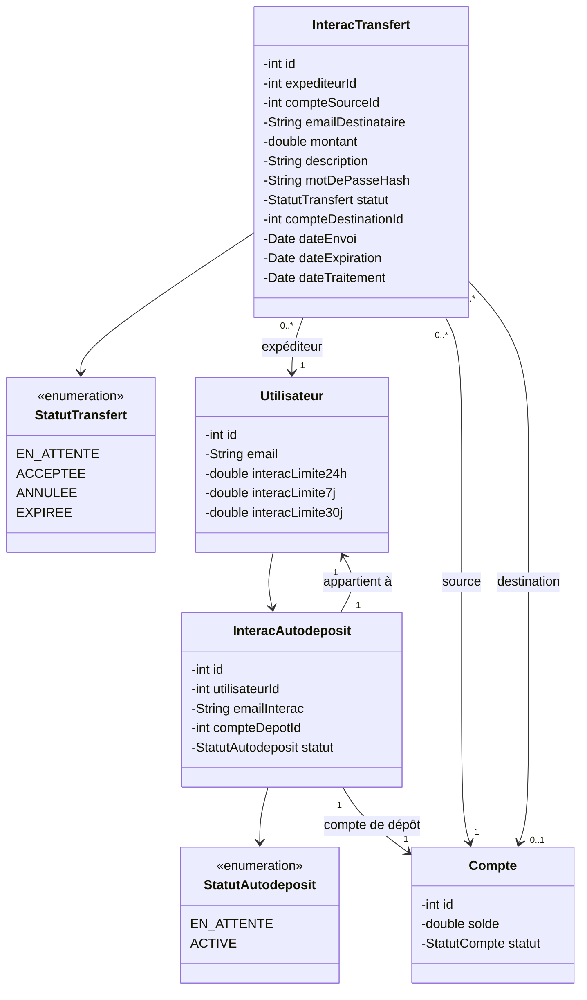
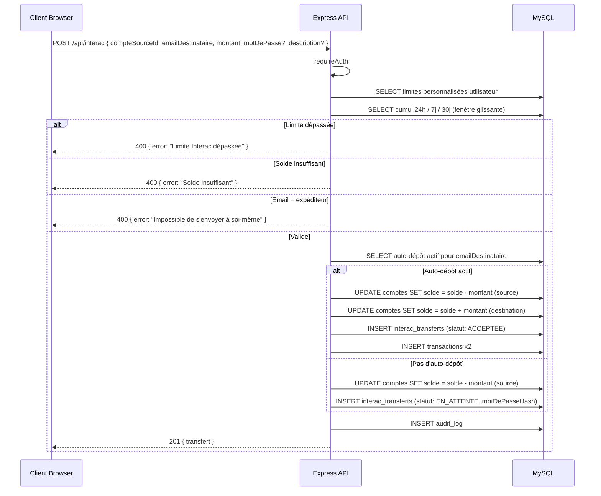
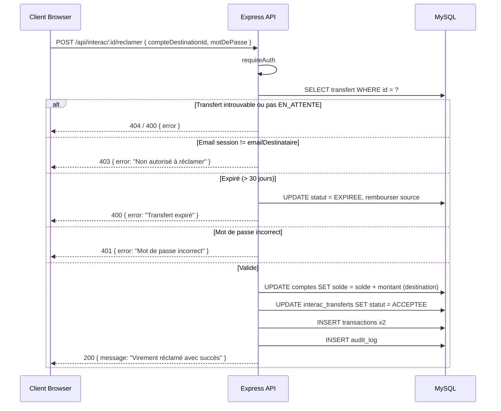
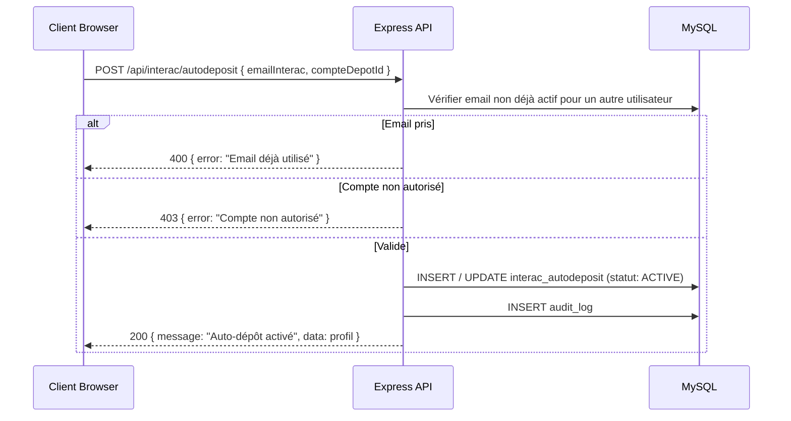
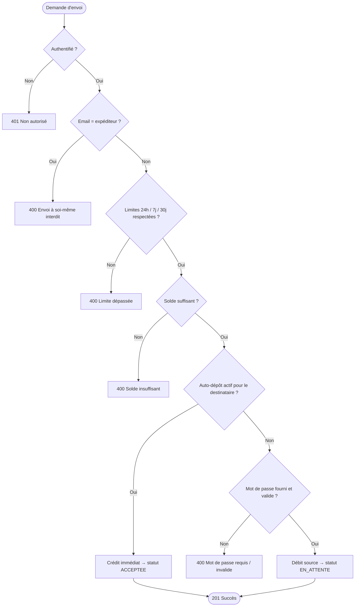

# Conception — Interac e-Transfer

## Description

Le module Interac e-Transfer permet aux clients d'envoyer et de recevoir de l'argent par courriel. La fonctionnalité reproduit les règles d'Interac Canada : limites glissantes 24h/7j/30j, mot de passe partagé hors-canal, auto-dépôt en une seule étape, expiration automatique des transferts non réclamés, et gestion administrative des limites personnalisées par client.

---

## Diagramme de cas d'utilisation

---

## Diagramme de classes

---

## Diagramme de séquence — Envoi d'un virement

---

## Diagramme de séquence — Réclamation d'un virement

---

## Diagramme de séquence — Activation auto-dépôt (1 étape)

---

## Flowchart — Validation d'un envoi Interac

---

## Schéma des tables

### Table `interac_transferts`

| Colonne | Type | Contraintes |
|---------|------|-------------|
| id | INT | PK, AUTO_INCREMENT |
| expediteur_id | INT | FK → utilisateurs.id, NOT NULL |
| compte_source_id | INT | FK → comptes.id, NOT NULL |
| email_destinataire | VARCHAR(190) | NOT NULL |
| montant | DECIMAL(12,2) | NOT NULL |
| description | VARCHAR(255) | nullable |
| mot_de_passe_hash | VARCHAR(255) | nullable (NULL si auto-dépôt) |
| statut | ENUM('EN_ATTENTE','ACCEPTEE','ANNULEE','EXPIREE') | DEFAULT 'EN_ATTENTE' |
| compte_destination_id | INT | FK → comptes.id, nullable |
| date_envoi | DATETIME | DEFAULT CURRENT_TIMESTAMP |
| date_expiration | DATETIME | date_envoi + 30 jours |
| date_traitement | DATETIME | nullable |

### Table `interac_autodeposit`

| Colonne | Type | Contraintes |
|---------|------|-------------|
| id | INT | PK, AUTO_INCREMENT |
| utilisateur_id | INT | FK → utilisateurs.id, UNIQUE |
| email_interac | VARCHAR(190) | UNIQUE, NOT NULL |
| compte_depot_id | INT | FK → comptes.id, NOT NULL |
| statut | ENUM('EN_ATTENTE','ACTIVE') | DEFAULT 'EN_ATTENTE' |
| token_verification | CHAR(6) | nullable |
| token_expire_le | DATETIME | nullable |
| cree_le | TIMESTAMP | DEFAULT CURRENT_TIMESTAMP |
| modifie_le | TIMESTAMP | ON UPDATE CURRENT_TIMESTAMP |

### Colonnes ajoutées à `utilisateurs` (limites personnalisées)

| Colonne | Type | Contraintes |
|---------|------|-------------|
| interac_limite_24h | DECIMAL(10,2) | nullable — NULL = limite globale (3 000 $) |
| interac_limite_7j | DECIMAL(10,2) | nullable — NULL = limite globale (10 000 $) |
| interac_limite_30j | DECIMAL(10,2) | nullable — NULL = limite globale (20 000 $) |

---

## Règles métier

| Règle | Description |
|-------|-------------|
| RB-INT-01 | Montant minimum : 0,50 $ CAD |
| RB-INT-02 | Limites globales d'envoi : 3 000 $ / 24h · 10 000 $ / 7j · 20 000 $ / 30j (fenêtres glissantes) |
| RB-INT-03 | Un administrateur peut personnaliser les limites par client ; `null` rétablit la limite globale |
| RB-INT-04 | Les transferts ANNULEE et EXPIREE ne comptent pas dans le cumul des limites |
| RB-INT-05 | Un utilisateur ne peut pas s'envoyer un virement à lui-même |
| RB-INT-06 | Le compte source est débité immédiatement à l'envoi (fonds en transit) |
| RB-INT-07 | Un transfert expire après 30 jours ; l'expiration est déclenchée à la prochaine lecture (lazy) |
| RB-INT-08 | L'expiration d'un transfert rembourse automatiquement le compte source |
| RB-INT-09 | Le mot de passe Interac doit comporter entre 3 et 25 caractères, ne pas être l'email du destinataire ni le montant |
| RB-INT-10 | Le mot de passe est stocké en hash bcrypt (10 rounds) — jamais retourné dans les réponses |
| RB-INT-11 | L'activation auto-dépôt est immédiate (1 étape) ; l'unicité de l'email est vérifiée avant toute écriture |
| RB-INT-12 | Si l'auto-dépôt est actif pour l'email destinataire, le transfert est accepté immédiatement sans mot de passe |
| RB-INT-13 | Seul l'expéditeur peut annuler un transfert EN_ATTENTE |
| RB-INT-14 | Seul le destinataire (email correspondant) peut réclamer un transfert |
