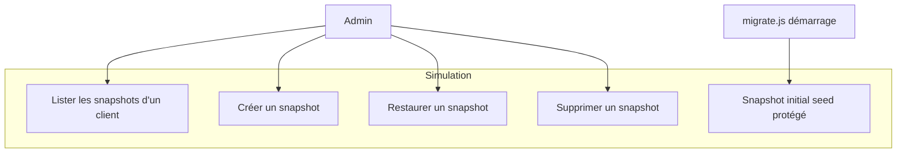
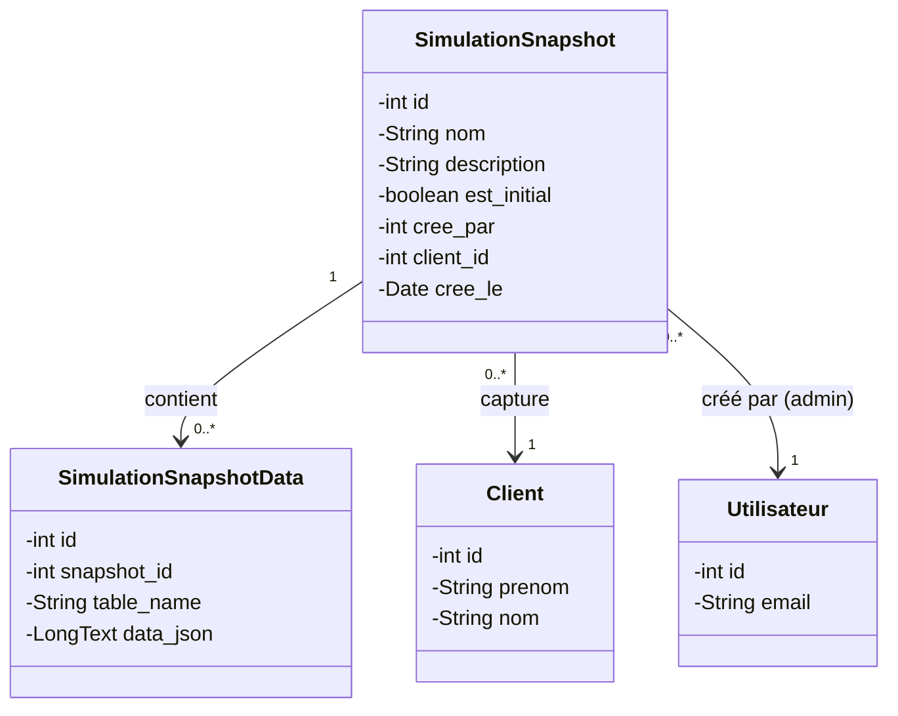
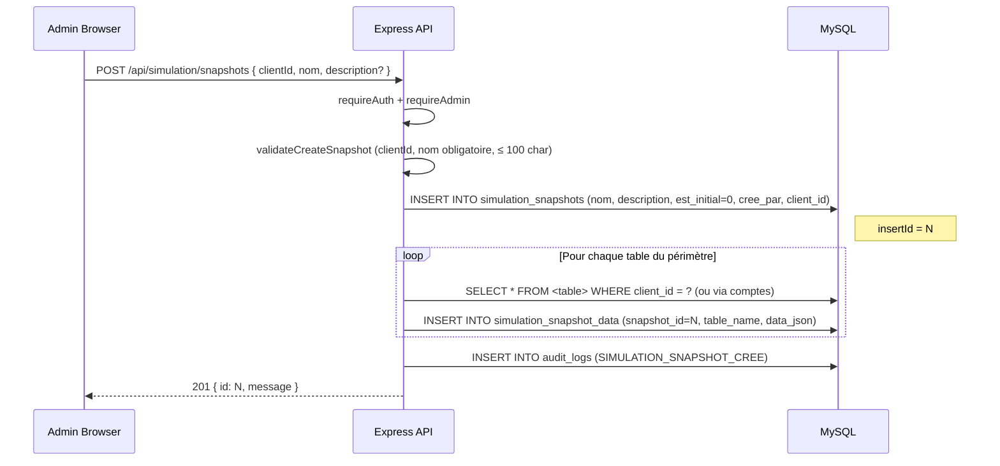
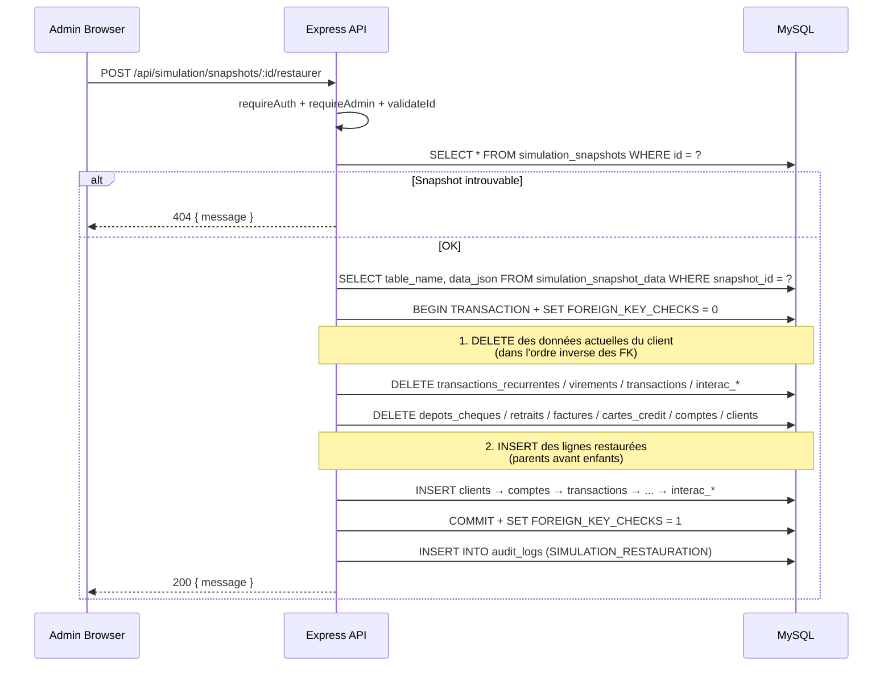
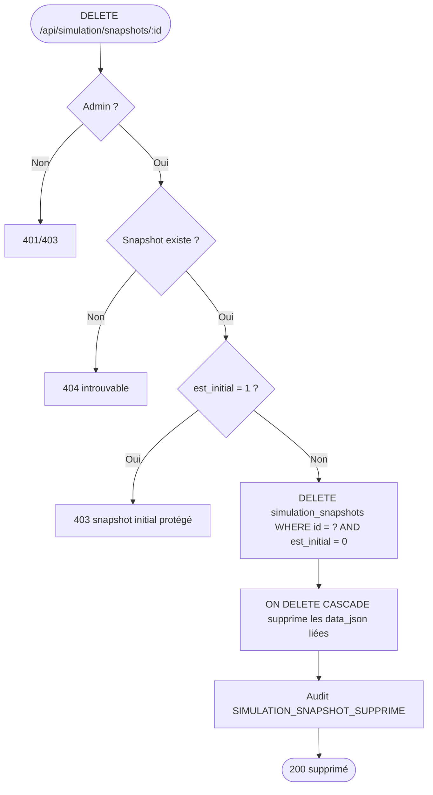

# Conception — Mode Simulation (Snapshots & Restauration)

## Description

Permettre à un **administrateur** de capturer l'état complet des données
financières d'un client (comptes, transactions, virements, factures, cartes,
dépôts, retraits, récurrentes, Interac) dans un **snapshot** nommé, puis de
**restaurer** ce snapshot à tout moment.

Le système est utile pour :
- Présenter une démonstration sans risquer de corrompre les données seed
- Tester un scénario destructeur (virements en chaîne, fermetures de comptes)
  puis revenir à l'état initial en un clic
- Préparer plusieurs jeux de données pour une présentation

Chaque snapshot est **isolé par client** : restaurer le snapshot du client A
n'affecte jamais les données du client B. Les comptes utilisateurs, sessions
et logs d'audit ne sont **jamais** capturés ni restaurés.

---

## Diagramme de cas d'utilisation

> Toutes les routes du module sont **ADMIN only** (`requireAdmin`).

---

## Diagramme de classes

---

## Diagramme de séquence — Création d'un snapshot

---

## Diagramme de séquence — Restauration

---

## Flowchart — Suppression

---

## Périmètre des tables capturées

### Capturées (par client)

| Table | Filtre |
|-------|--------|
| `clients` | `id = clientId` |
| `comptes` | `client_id = clientId` |
| `transactions` | `compte_id IN (comptes du client)` |
| `virements` | `compte_source_id OR compte_destination_id IN (comptes du client)` |
| `factures` | `client_id = clientId` |
| `cartes_credit` | `client_id = clientId` |
| `depots_cheques` | `client_id = clientId` |
| `retraits` | `client_id = clientId` |
| `transactions_recurrentes` | `compte_source_id OR compte_destination_id IN (comptes du client)` |
| `interac_beneficiaires` | `utilisateur_id IN (utilisateurs du client)` |
| `interac_autodeposit` | `utilisateur_id IN (utilisateurs du client)` |

### Exclues (jamais touchées)

`utilisateurs`, `audit_logs`, `sessions`, `utilisateurs_clients`,
`simulation_snapshots`, `simulation_snapshot_data`.

> La liaison `utilisateurs_clients` n'est jamais reset : un compte utilisateur
> conserve toujours l'accès à son client, peu importe les restaurations.

---

## Schéma — `simulation_snapshots`

| Colonne | Type | Contraintes |
|---------|------|-------------|
| id | INT | PK, AUTO_INCREMENT |
| nom | VARCHAR(100) | NOT NULL |
| description | VARCHAR(255) | nullable |
| est_initial | TINYINT(1) | DEFAULT 0 (1 = protégé, non supprimable) |
| cree_par | INT | FK → utilisateurs.id, NOT NULL |
| client_id | INT | FK → clients.id, NOT NULL |
| cree_le | TIMESTAMP | DEFAULT CURRENT_TIMESTAMP |

## Schéma — `simulation_snapshot_data`

| Colonne | Type | Contraintes |
|---------|------|-------------|
| id | INT | PK, AUTO_INCREMENT |
| snapshot_id | INT | FK → simulation_snapshots.id, **ON DELETE CASCADE** |
| table_name | VARCHAR(64) | NOT NULL |
| data_json | LONGTEXT | NOT NULL — `JSON.stringify` du tableau de lignes |

---

## Snapshot initial protégé

À chaque démarrage de `database/migrate.js` :

1. Pour chaque client existant en base
2. Vérifier s'il a déjà un snapshot avec `est_initial = 1`
3. Sinon : capturer son état actuel sous le nom `"État initial (seed)"`
   avec `est_initial = 1`

Conséquences :
- Tous les clients seedés ont **automatiquement** un point de retour
- Le snapshot initial est **non supprimable** via l'API (`403`)
- Il peut être **restauré** comme n'importe quel autre snapshot

---

## Règles métier

| Règle | Description |
|-------|-------------|
| RB-SIM-01 | Toutes les routes nécessitent ADMIN |
| RB-SIM-02 | Un snapshot est toujours associé à un seul `client_id` |
| RB-SIM-03 | Le `nom` est obligatoire et ≤ 100 caractères |
| RB-SIM-04 | La restauration s'exécute dans une transaction avec FK_CHECKS=0 |
| RB-SIM-05 | La restauration supprime les données actuelles du client AVANT d'insérer |
| RB-SIM-06 | Un snapshot avec `est_initial = 1` ne peut jamais être supprimé |
| RB-SIM-07 | La suppression d'un snapshot cascade sur `simulation_snapshot_data` |
| RB-SIM-08 | Les utilisateurs/sessions/audit ne sont jamais touchés |
| RB-SIM-09 | La liaison `utilisateurs_clients` est préservée à la restauration |
| RB-SIM-10 | Chaque opération (création / restauration / suppression) est auditée |

---

## Audit

| Action | Déclencheur |
|--------|-------------|
| `SIMULATION_SNAPSHOT_CREE` | POST /snapshots |
| `SIMULATION_RESTAURATION` | POST /snapshots/:id/restaurer |
| `SIMULATION_SNAPSHOT_SUPPRIME` | DELETE /snapshots/:id |

---

## Décisions techniques

| Décision | Justification |
|----------|---------------|
| Snapshots **par client** (pas globaux) | Permet à plusieurs admins de tester en parallèle sans interférence |
| Stockage `LONGTEXT` JSON par table | Plus simple qu'une table colonne-par-colonne ; lecture/écriture unique |
| `SET FOREIGN_KEY_CHECKS = 0` | Évite l'ordre strict des DELETE/INSERT, dans une transaction sécurisée |
| Snapshot initial créé au migrate | L'utilisateur a toujours un retour au seed sans action manuelle |
| `ON DELETE CASCADE` sur `snapshot_data` | Pas de logique applicative à maintenir pour le nettoyage |
| Exclusion `utilisateurs_clients` | Sinon un client perdrait l'accès de ses users après restauration |
| Validation par middleware | `validateClientIdQuery`, `validateCreateSnapshot`, `validateId` — contrôleur reste mince |

---

## Référence

- API : `documentation API/simulation.md`
- Documentation fonctionnelle : `docs/simulation.md`
- Code : `server/data/simulation.data.js`, `server/controllers/simulation.controller.js`, `server/routes/simulation.routes.js`
