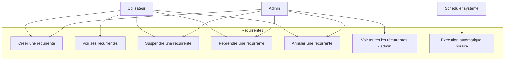
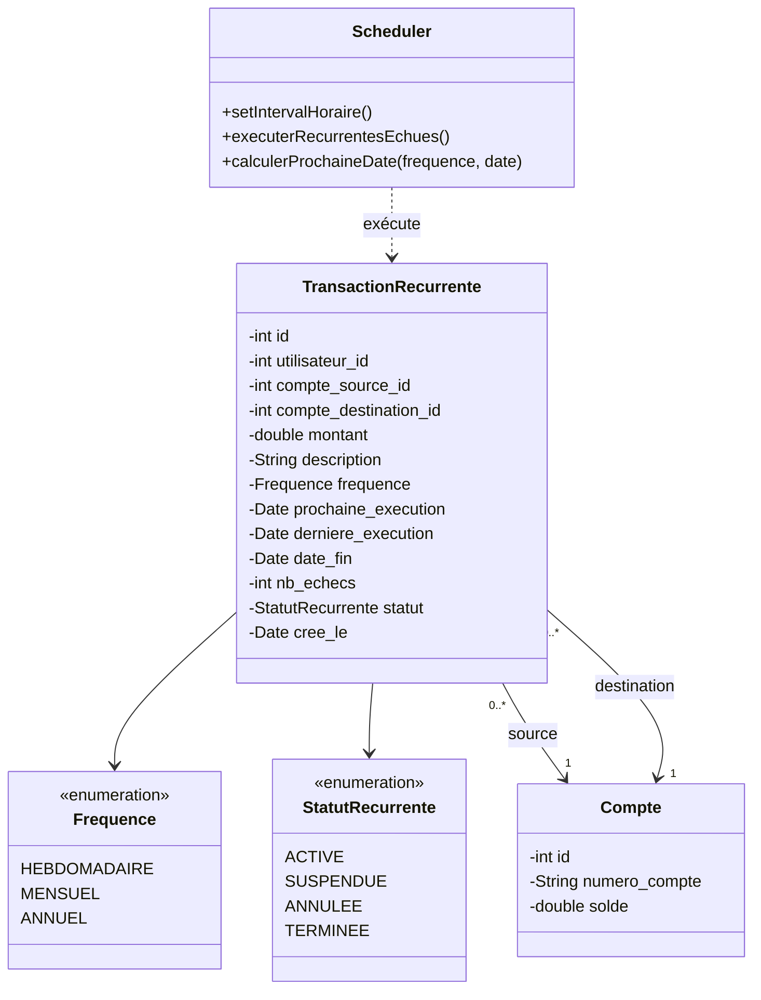
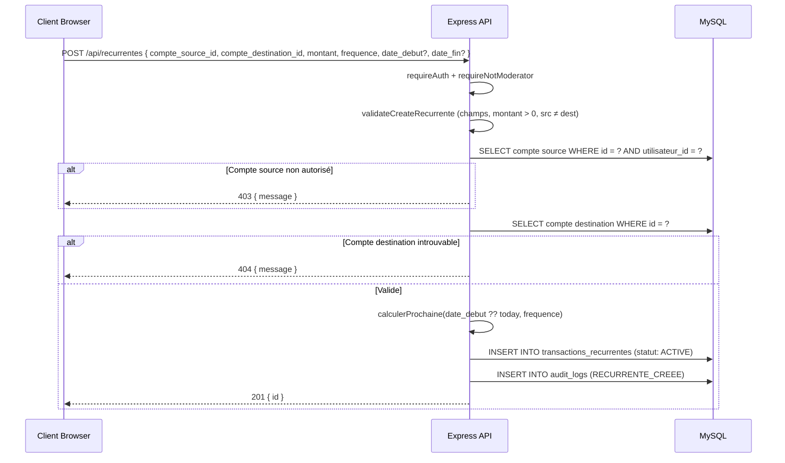
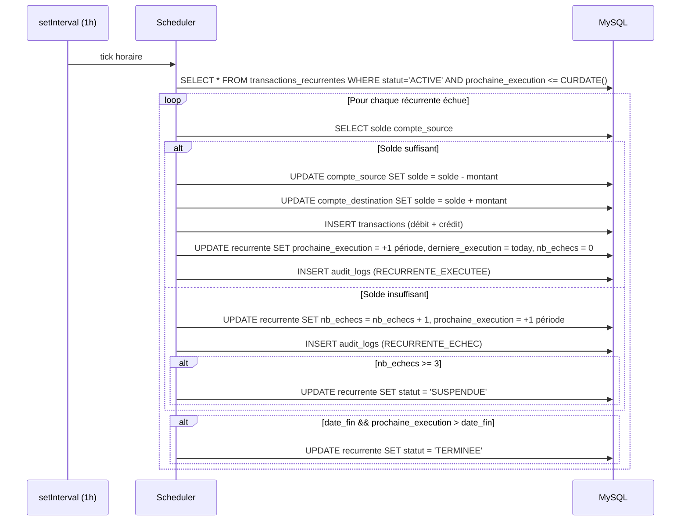
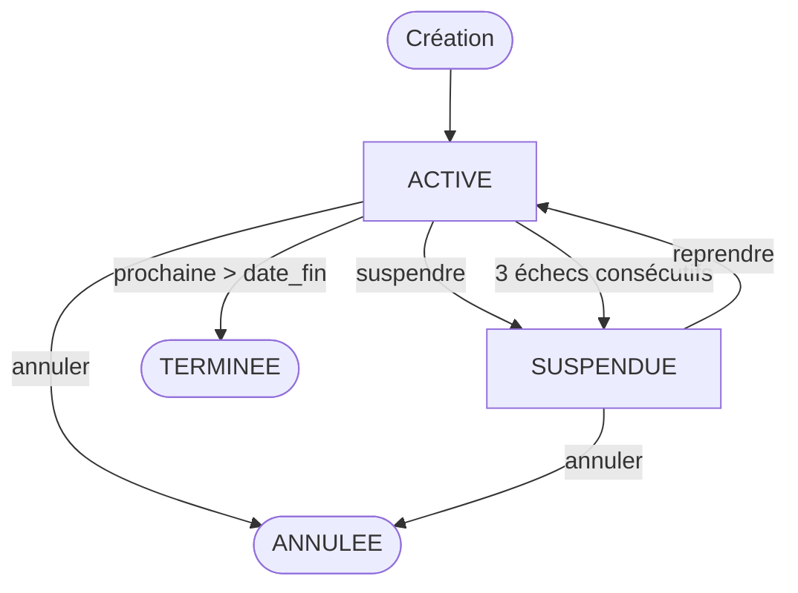
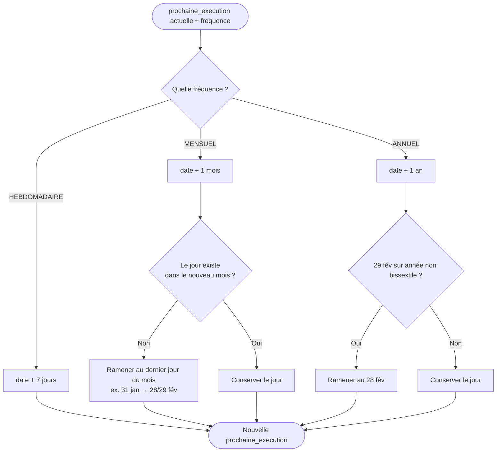

# Conception — Transactions récurrentes

## Description

Permettre aux utilisateurs de planifier des **virements automatiques** répétés
entre deux comptes selon une fréquence (hebdomadaire, mensuelle, annuelle).
Un **scheduler** côté serveur exécute les récurrentes échues toutes les heures
sans intervention humaine, gère les échecs (solde insuffisant) avec un compteur
de tentatives, et suspend automatiquement la récurrente après 3 échecs.

Les statuts possibles sont : `ACTIVE`, `SUSPENDUE`, `ANNULEE`, `TERMINEE`.

---

## Diagramme de cas d'utilisation

> Les MODÉRATEURS n'ont **aucun** accès aux transactions récurrentes :
> il s'agit d'une opération financière initiée par le client.

---

## Diagramme de classes

---

## Diagramme de séquence — Création

---

## Diagramme de séquence — Exécution par le scheduler

---

## Flowchart — Cycle de vie

---

## Flowchart — Calcul de la prochaine date

---

## Schéma de la table `transactions_recurrentes`

| Colonne | Type | Contraintes |
|---------|------|-------------|
| id | INT | PK, AUTO_INCREMENT |
| utilisateur_id | INT | FK → utilisateurs.id, NOT NULL |
| compte_source_id | INT | FK → comptes.id, NOT NULL |
| compte_destination_id | INT | FK → comptes.id, NOT NULL |
| montant | DECIMAL(12,2) | NOT NULL, > 0 |
| description | VARCHAR(255) | nullable |
| frequence | ENUM('HEBDOMADAIRE','MENSUEL','ANNUEL') | NOT NULL |
| prochaine_execution | DATE | NOT NULL |
| derniere_execution | DATE | nullable |
| date_fin | DATE | nullable (null = pas de fin) |
| nb_echecs | INT | DEFAULT 0 |
| statut | ENUM('ACTIVE','SUSPENDUE','ANNULEE','TERMINEE') | DEFAULT 'ACTIVE' |
| cree_le | TIMESTAMP | DEFAULT CURRENT_TIMESTAMP |

---

## Règles métier

| Règle | Description |
|-------|-------------|
| RB-REC-01 | Le compte source doit appartenir à l'utilisateur créateur |
| RB-REC-02 | Le compte destination peut appartenir à n'importe quel utilisateur |
| RB-REC-03 | `compte_source_id` ≠ `compte_destination_id` |
| RB-REC-04 | `montant` doit être strictement positif |
| RB-REC-05 | La fréquence doit être une valeur valide (HEBDOMADAIRE / MENSUEL / ANNUEL) |
| RB-REC-06 | Le virement n'est PAS exécuté immédiatement à la création |
| RB-REC-07 | Le scheduler tourne au démarrage du serveur puis toutes les heures |
| RB-REC-08 | Sur échec d'exécution, `nb_echecs += 1` et la date avance quand même |
| RB-REC-09 | Une récurrente passe à `SUSPENDUE` automatiquement après 3 échecs |
| RB-REC-10 | Une récurrente `ANNULEE` ou `TERMINEE` ne peut plus être relancée |
| RB-REC-11 | L'ADMIN peut suspendre/reprendre/annuler la récurrente de n'importe qui |
| RB-REC-12 | MODÉRATEUR n'a aucun accès aux récurrentes |
| RB-REC-13 | Le calcul mensuel gère la fin de mois (31 jan → 28/29 fév) |
| RB-REC-14 | Le calcul annuel gère le 29 fév en année non bissextile |
| RB-REC-15 | Chaque exécution réussie génère 2 transactions (débit + crédit) et un audit log |

---

## Audit

| Action | Déclencheur |
|--------|-------------|
| `RECURRENTE_CREEE` | Création d'une nouvelle récurrente |
| `RECURRENTE_SUSPENDUE` | Suspension manuelle |
| `RECURRENTE_REPRISE` | Reprise manuelle |
| `RECURRENTE_ANNULEE` | Annulation manuelle |
| `RECURRENTE_EXECUTEE` | Exécution réussie par le scheduler |
| `RECURRENTE_ECHEC` | Échec d'exécution (solde insuffisant) |

---

## Décisions techniques

| Décision | Justification |
|----------|---------------|
| `setInterval` 1h plutôt que cron OS | Pas de dépendance externe, démarre avec le serveur |
| Avancer la date même sur échec | Évite les boucles infinies sur un compte vide |
| Suspension auto à 3 échecs | Stoppe les notifications/audit inutiles, force action utilisateur |
| `prochaines_executions` calculé à la lecture | Pas besoin de matérialiser N dates en DB |
| Validation 2 couches | Middleware (`validateCreateRecurrente`) + contrôleur (autorisation compte) |
| MODÉRATEUR exclu | Une récurrente est un mandat permanent du client |

---

## Référence

- API : `documentation API/recurrentes.md`
- Documentation fonctionnelle : `docs/transactions-recurrentes.md`
- Code : `server/data/recurrentes.data.js`, `server/controllers/recurrentes.controller.js`, `server/scheduler.js`
