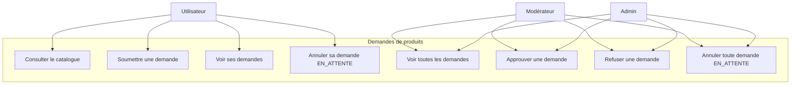
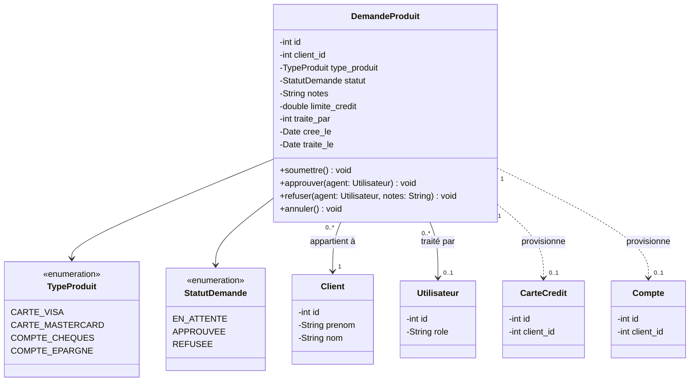
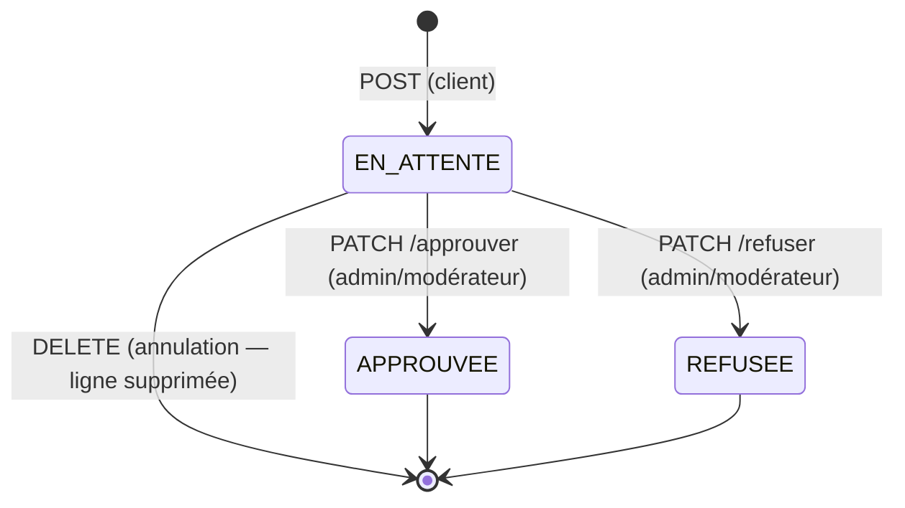
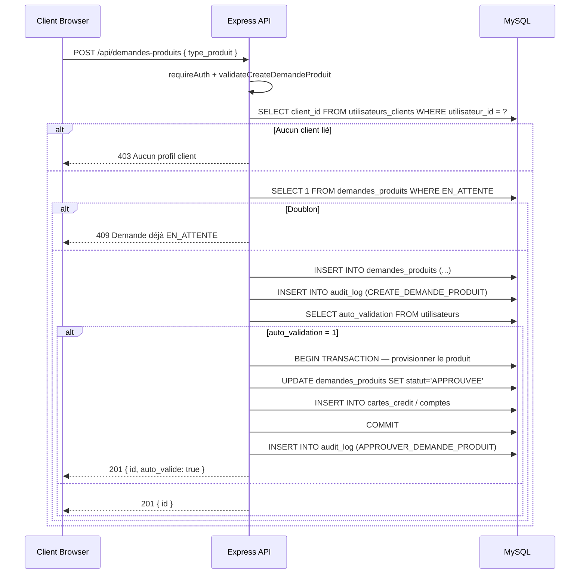
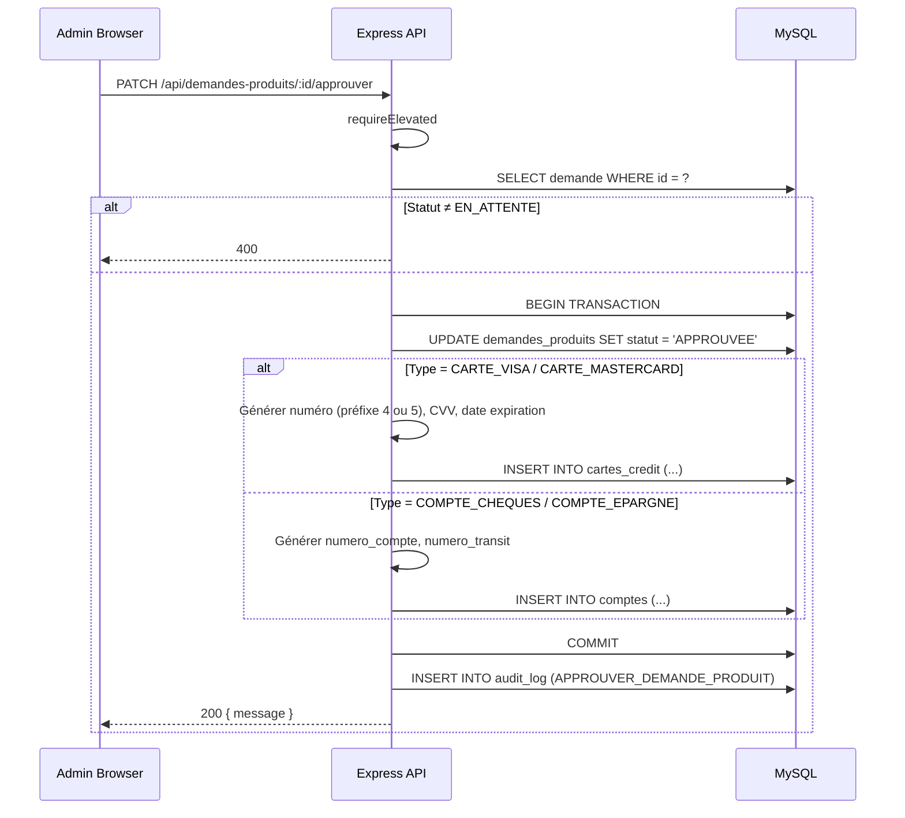
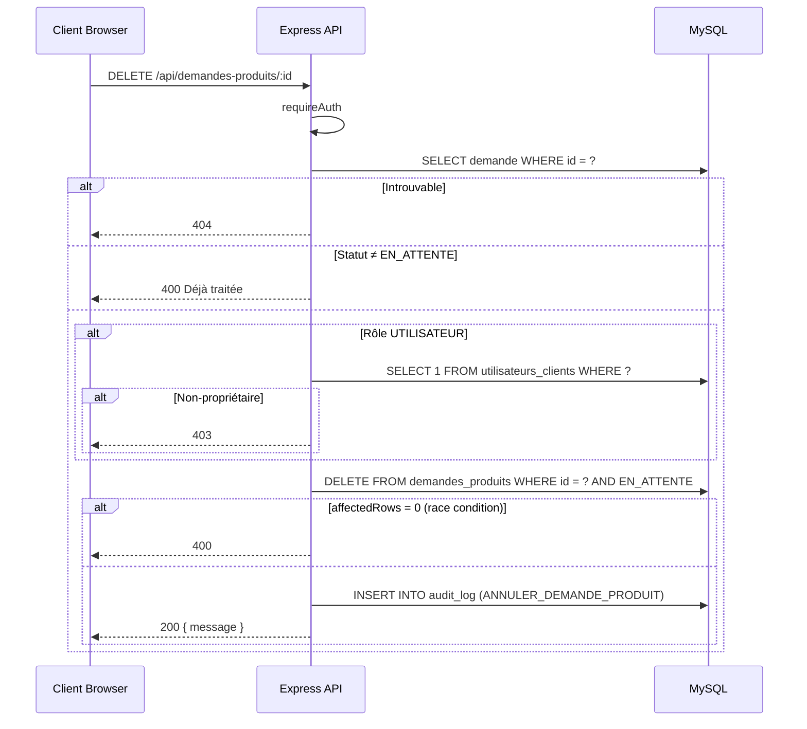

# Conception — Demandes de produits financiers

## Description

Catalogue de produits bancaires consultable par les clients depuis `/dashboard/produits`. Un client peut demander l'ouverture d'un produit (Carte VISA, Carte Mastercard, Compte CHEQUES, Compte EPARGNE). Un admin/modérateur examine la demande et peut l'approuver (le produit est automatiquement provisionné) ou la refuser. Le client peut également annuler sa propre demande tant qu'elle est encore `EN_ATTENTE`.

---

## Diagramme de cas d'utilisation

---

## Diagramme de classes

---

## Diagramme d'états — Demande de produit

Une demande en statut `APPROUVEE` ou `REFUSEE` est immuable. L'annulation supprime physiquement la ligne : le client peut donc soumettre une nouvelle demande du même type immédiatement après.

---

## Diagramme de séquence — Soumettre une demande

---

## Diagramme de séquence — Approuver (provisionnement automatique)

Si l'INSERT du produit échoue (ex : contrainte DB), la transaction est ROLLBACK. Le statut de la demande n'est pas modifié, l'admin peut retenter.

---

## Diagramme de séquence — Annuler une demande (client)

---

## Modèle de données

Table `demandes_produits` :

| Colonne | Type | Contraintes |
|---------|------|-------------|
| `id` | INT AUTO_INCREMENT | PK |
| `client_id` | INT | FK → `clients.id` ON DELETE CASCADE |
| `type_produit` | ENUM(…) | NOT NULL |
| `statut` | ENUM('EN_ATTENTE','APPROUVEE','REFUSEE') | DEFAULT 'EN_ATTENTE' |
| `notes` | VARCHAR(255) | NULL |
| `limite_credit` | DECIMAL(12,2) | NULL (cartes uniquement) |
| `traite_par` | INT | FK → `utilisateurs.id` ON DELETE SET NULL |
| `cree_le` | TIMESTAMP | DEFAULT CURRENT_TIMESTAMP |
| `traite_le` | TIMESTAMP | NULL |

Index : `idx_dp_client`, `idx_dp_statut`, `idx_dp_type`.

---

## Règles métier synthèse

- Un client ne peut avoir qu'**une seule demande EN_ATTENTE** par type de produit (contrainte applicative via `hasPendingDemande`).
- L'approbation est **atomique** : statut + création du produit dans la même transaction SQL.
- Le provisionnement réutilise les **mêmes générateurs** (`numero_compte` 3×4 chiffres, numéro de carte préfixé par 4 ou 5) que les endpoints `POST /api/cartes` et `POST /api/comptes`.
- L'annulation est **réversible** au sens applicatif : la ligne est supprimée et le client peut redemander immédiatement.
- Un `MODERATEUR` ne peut pas **soumettre** de demande (middleware `requireNotModerator`) mais peut **approuver/refuser/annuler** (requireElevated / requireAuth).

---

## Fichiers concernés

| Fichier | Rôle |
|---------|------|
| `database/schema.sql` | Table `demandes_produits` |
| `server/data/demandes_produits.data.js` | Couche d'accès SQL |
| `server/controllers/demandes_produits.controller.js` | Logique métier |
| `server/routes/demandes_produits.routes.js` | Déclaration des routes |
| `server/middlewares/validation.middleware.js` | `validateCreateDemandeProduit` |
| `frontend/src/app/dashboard/produits/page.tsx` | Interface catalogue client |
| `frontend/src/app/dashboard/admin/demandes/page.tsx` | Interface gestion admin |
| `frontend/src/components/CreditCard3D.tsx` | Visuel 3D carte (variant VISA/Mastercard) |
